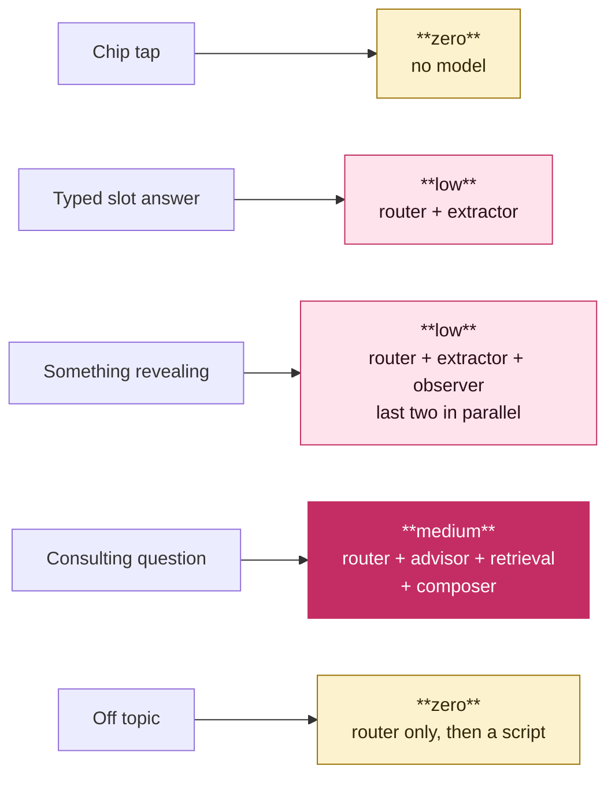

# Agent architecture

**Date:** 2026-09-20 · **Status:** proposed · **Decision:** PD7a
**Supersedes** the single-model assumption in `ai-agent-design.md`.

---

## The verdict in one line

**You do not want a multi-agent system. You want a router and small
specialist handlers.** This design costs less than a single large model *and*
less than a multi-agent system. It also fixes hallucination through its
structure, not through the prompt.

---

## Where the multi-agent instinct is right, and where it is wrong

**Right:** a small model that does one narrow job is much cheaper and much more
reliable than a large model that does all the jobs.

**Wrong:** the decrease in cost comes from **model size for each task**, not
from **number of agents**. More agents add cost:

| What agents add | Why it costs |
|---|---|
| Each agent has its own system prompt | More input tokens on each turn, not fewer |
| Handoffs pass state | Each handoff serialises the state, reads it again and repeats the context |
| Calls run in sequence | The latency of each call adds to the total. Users notice three seconds in a chat. |
| More parts | More failure modes, and a much more complex eval suite |

"Specialised agents think less" is correct for each agent. But it is incorrect
for the system if all the agents run on each turn.

**The fix is not more agents. The fix is fewer calls to expensive models.**
Send each turn to the cheapest thing that can handle it. Make sure that most
turns do not go to a large model at all.

---

## Two forms, not one

This idea is correct. It is the centre of the design.

### Form A — the filter form

Form A drives the SQL query and the listings panel. It holds hard constraints
only.

It contains intent, budget, areas, move date, room type, and the nine lifestyle
axes with weights. Each slot has a type and a fixed set of values.
`ai-agent-design.md` section 3.1 describes this form.

### Form B — the profile

Form B holds all the other information that the user reveals. Chips cannot
capture this information. It is the reason that the product exists.

**Form B must have a structure. It must not be a text blob.** A text blob that
grows is the transcript with a different name. Then Form B has no purpose.

```
observation: {
  key:        "guest_frequency",
  value:      "partner stays over most nights",
  kind:       "constraint" | "preference" | "context" | "concern",
  evidence:   "my ex basically lived there, that's what killed it",
  turn:       11,
  confidence: 0.82,
  visible:    true
}
```

**Each observation must contain the user's actual words.** If the model cannot
give a verbatim span from the turn, the system rejects the observation. This
one rule is the strongest anti-hallucination device available here. It forces
each stored fact to point at real text.

**Build Form B one turn at a time, not in one pass at the end.** This costs
less, because each call sees one turn, not the full conversation. Also, Form B
is available during the session. Thus, it can inform the ranking while the user
browses.

**The user can see and edit Form B.** This is good product. It is also how we
meet the DPDP access and correction obligations with no more work.

---

## The router

The router classifies each turn first. This is the cost lever and the on-rails
lever at the same time.

| Turn type | Handler | Model |
|---|---|---|
| Chip tap | Scripted next question | **None** |
| Answer to a closed question | Extractor → Form A | Small, constrained |
| Something revealing | Observer → Form B | Small |
| Consulting question | Advisor, grounded | Small + retrieval |
| Off topic | Scripted redirect | **None** |
| Safety signal | Scripted response, logged | **None** |

One turn can be more than one type. "I need Powai under 20k, my last place fell
apart because of my flatmate's boyfriend" fills slots *and* reveals something.
**Run the Extractor and the Observer in parallel** on the same input. The two
handlers are small and cheap.

**Keep the router rules-based where possible.** The router knows a chip tap
from the client. Thus, a chip tap needs no classification. Only free text needs
the classifier.

### The composer

The composer is the only expensive call. It writes the free text that goes
back to the user.

It gets Form A, Form B and the last two turns. It does not get the transcript at any time.

**Many turns do not need the composer.** A chip tap gets a scripted question. A
clean slot answer gets a scripted acknowledgement and the next question. The
composer runs when the reply genuinely needs new text. These turns are a
minority.

---

## RAG: yes, for exactly one thing

**Not for listings.** For listings, retrieval is a structured query in
Postgres. We decided this in `cost-and-team.md`.

**Yes for consulting questions.** An example is "What should I watch out for
legally when renting in Mumbai". This is the type of question where a general model
hallucinates. An incorrect answer also causes the most damage here. Thus,
ground the answer.

The corpus is your own material: the blog articles that marketing will write
next, a rental FAQ, area guides, and a deposit and agreement explainer.

**Still no vector store.** The corpus is dozens of documents, not millions.
Postgres full-text search gives good results for a corpus of this size. This
does not break ADR 0001, because no proprietary extension goes on the critical
path. It also removes one decision and one line of spend.

**The Advisor refuses when the corpus has no answer.** It does not use the
general knowledge of the model as a fallback. That is the full purpose of the
grounding.

This also makes a useful loop. Each consulting question with no good answer is
a blog article that marketing should write.

---

## The architecture


**Key to the colours.** Yellow has no cost. Pink is a small, cheap model. Dark
pink is the only expensive call, and most turns do not get to it.

### Two things the diagram does not show well

**The Extractor and the Observer run in parallel.** One turn can be the two
types, as the Powai example in the router section shows. The two handlers
see the same input at the same time. Neither handler waits for the other.

**The Composer frequently does not run.** A chip tap receives a scripted question.
A clean slot answer receives a scripted acknowledgement and the next question. The Composer runs only when a reply genuinely needs new text.

### Cost per turn, by path



In all interviews, the first three turns are chip taps. These turns have no
cost.

## How this answers each worry

| Worry | Answer |
|---|---|
| It hallucinates | The Extractor can use only enum values. The Observer must quote the user. The Advisor is grounded, and it refuses. The Composer states no facts about listings. No part remains that can invent. |
| The chat wanders | The router finds off-topic turns before any expensive call, and it sends a scripted redirect. This is cheap and on rails. |
| The form alone is too thin a profile | Form B captures all the other information. It has a structure and evidence. |
| Consulting questions pollute the profile | They are a separate turn type with a separate handler. They write to neither form. |
| Multi-agent costs more | It would. But a router with small handlers costs less than one large model, because the large model runs rarely. |

---

## Cost, honestly

This design should cost **less** than a single-model design. The reason is
that the expensive model runs on a minority of turns, not on all turns.

Added calls: one router call for each free-text turn. This call is small, and
chip taps do not use it.

**Two things to watch:**

1. **Latency adds up.** The router and then the extractor are two sequential
   calls before the panel can move. Keep the router very small. Run the
   extractor and the observer in parallel. Do not add a third sequential hop
   without a measurement.
2. **Do not let this grow.** Each new handler is a new prompt, a new eval set
   and a new failure mode. Six handlers is a design. For four part-time
   engineers, twelve handlers is a maintenance problem.

Measure the cost of each completed interview from the first day. Record this
cost for each handler. Then you know which handler to make smaller.

---

## What this changes elsewhere

- **Schema.** Form A and Form B each need a home. Neither form is in S1 to S7
  of the ledger. Form B is personal data that comes from free text. Thus,
  account deletion must purge it.
- **Evals.** Each handler gets its own score: router accuracy, extractor
  accuracy, observer evidence validity, advisor grounding and refusal rate.
  Separate handlers make evals easier, not more complex, because each handler
  has one job.
- **`packages/contract`.** Handler inputs and outputs are Zod schemas with
  versions. They are next to the analytics event schemas in the package.
- **Model choice (PD7).** This design needs a small fast model and a good model.
  It does not need one model that is excellent at all tasks. Thus, there are
  more options and the price is lower.
