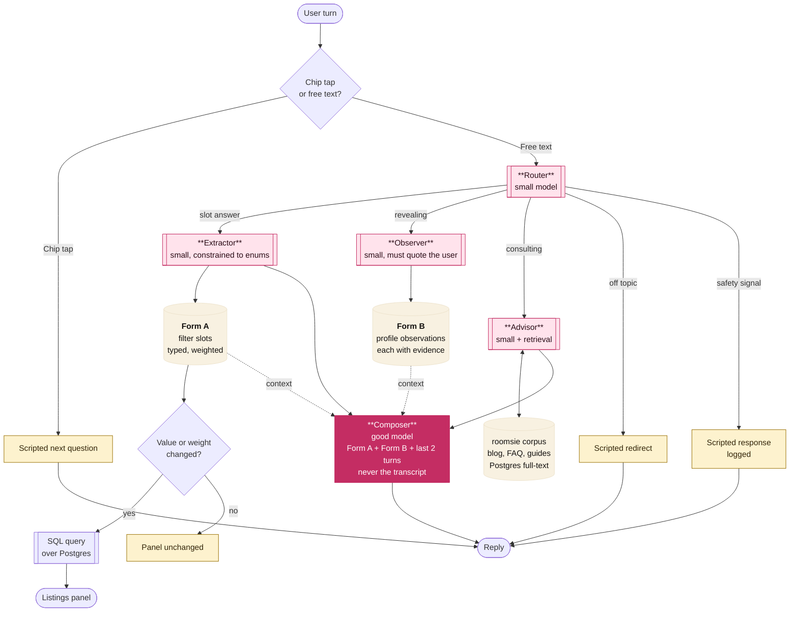
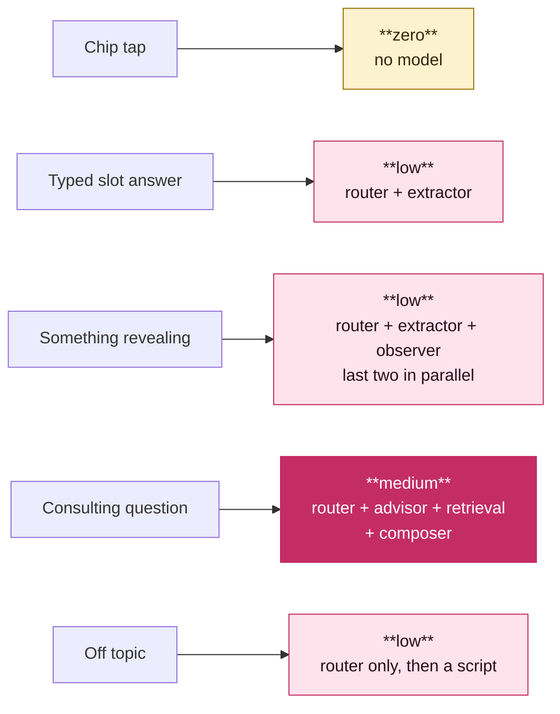

# Agent architecture

**Date:** 2026-09-20 · **Status:** proposed · **Decision:** PD7a
**Supersedes** the single-model assumption in `ai-agent-design.md`.

---

## The verdict in one line

- **You do not want a multi-agent system. You want a router and small specialist handlers.**
- This design costs less than a single large model *and* less than a multi-agent system.
- It fixes hallucination through its structure, not through the prompt.

---

## Where the multi-agent instinct is right, and where it is wrong

- Send each turn to the cheapest thing that can handle it.
- Make sure that most turns do not go to a large model at all.

Why: [PD7a](decisions/pd-07a-agent-architecture.md)

---

## Two forms, not one

There are two forms: Form A and Form B.

Why: [PD7a](decisions/pd-07a-agent-architecture.md)

### Form A — the filter form

- Form A drives the SQL query and the listings panel.
- It holds hard constraints only.
- It contains intent, budget, areas, move date, room type, and the nine lifestyle axes with weights.
- Each slot has a type and a fixed set of values.
- `ai-agent-design.md` section 3.1 describes this form.

### Form B — the profile

Form B holds all the other information that the user reveals.
**Form B must have a structure. It must not be a text blob.**

```
observation: {
  key:        "guest_frequency",
  value:      "partner stays over most nights",
  kind:       "constraint" | "preference" | "context" | "concern",
  evidence:   "my ex basically lived there, that's what killed it",
  turn:       11,
  confidence: 0.82,
  visible:    true
}
```

- **Each observation must contain the user's actual words.** If the model cannot give a verbatim span from the turn, the system rejects the observation.
- **Build Form B one turn at a time, not in one pass at the end.**
- **The user can see and edit Form B.** This is how we meet the DPDP access and correction obligations with no more work.

Why: [PD7a](decisions/pd-07a-agent-architecture.md), [PD3b](decisions/pd-03b-interview-vs-chips.md)

---

## The router

The router classifies each turn first.

| Turn type | Handler | Model |
|---|---|---|
| Chip tap | Scripted next question | **None** |
| Answer to a closed question | Extractor → Form A | Small, constrained |
| Something revealing | Observer → Form B | Small |
| Consulting question | Advisor, grounded | Small + retrieval |
| Off topic | Scripted redirect | **None** |
| Safety signal | Scripted response, logged | **None** |

- One turn can be more than one type. **Run the Extractor and the Observer in parallel** on the same input.
- **Keep the router rules-based where possible.** A chip tap needs no classification. Only free text needs the classifier.

Why: [PD7a](decisions/pd-07a-agent-architecture.md)

### The composer

- The composer is the only expensive call. It writes the free text that goes back to the user.
- It gets Form A, Form B and the last two turns. It does not get the transcript at all.
- **Many turns do not need the composer:**
  - A chip tap gets a scripted question.
  - A clean slot answer gets a scripted acknowledgement and the next question.
- The composer runs when the reply genuinely needs new text. These turns are a minority.

---

## RAG: yes, for exactly one thing

| Use | RAG | Retrieval |
|---|---|---|
| Listings | **No** | A structured query in Postgres. We decided this in `cost-and-team.md`. |
| Consulting questions | **Yes** | Ground the answer. |

- The corpus is your own material:
  - The blog articles that marketing will write next
  - A rental FAQ
  - Area guides
  - A deposit and agreement explainer
- **Still no vector store.** The corpus is dozens of documents, not millions.
- **The Advisor uses the corpus first.** For a general question with no corpus answer, signed-in users get a web search, and visitors get model knowledge, clearly hedged. Law, tax, area safety and claims about a person stay corpus-only or go to a hand-off. (PD7a)
- Each consulting question with no good answer is a blog article that marketing should write.

Why: [PD7a](decisions/pd-07a-agent-architecture.md), [PD10](decisions/pd-10-scope-bands.md), [PD5](decisions/pd-05-team-and-budget.md)

---

## The architecture



Why: [PD7a](decisions/pd-07a-agent-architecture.md)

### Two things the diagram does not show well

Why: [PD7a](decisions/pd-07a-agent-architecture.md)

### Cost per turn, by path



In all interviews, the first three turns are chip taps. These turns have no cost.

## How this answers each worry

Why: [PD7a](decisions/pd-07a-agent-architecture.md)

---

## Cost, honestly

- Added calls: one router call for each free-text turn. This call is small, and chip taps do not use it.
- **Watch 1: latency adds up.** Keep the router very small. Do not add a third sequential hop without a measurement.
- **Watch 2: do not let this grow.** For four part-time engineers, twelve handlers is a maintenance problem.
- Measure the cost of each completed interview from the first day. Record this cost for each handler.

Why: [PD7a](decisions/pd-07a-agent-architecture.md)

---

## What this changes elsewhere

- **Schema.** Form A and Form B each need a home. Neither form is in S1 to S7 of the ledger. Form B is personal data that comes from free text. Thus, account deletion must purge it.
- **Evals.** Each handler gets its own score: router accuracy, extractor accuracy, observer evidence validity, advisor grounding and refusal rate.
- **`packages/contract`.** Handler inputs and outputs are Zod schemas with versions. They are next to the analytics event schemas in the package.
- **Model choice (PD7).** This design needs a small fast model and a good model.

Why: [PD7a](decisions/pd-07a-agent-architecture.md), [PD7](decisions/pd-07-models.md)
