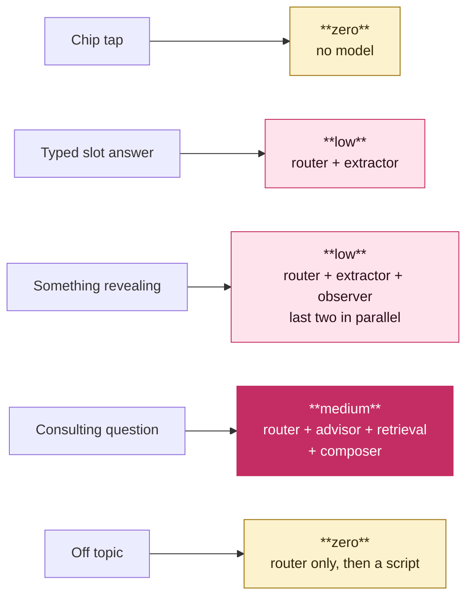

# Agent architecture

**Date:** 2026-09-20 · **Status:** proposed · **Decision:** PD7a
**Supersedes** the single-model assumption in `ai-agent-design.md`.

---

## The verdict in one line

**You do not want a multi-agent system. You want a router and small
specialist handlers.** That is cheaper than a single big model *and* cheaper
than multi-agent, and it fixes hallucination structurally rather than by
prompting.

---

## Where the multi-agent instinct is right, and where it is wrong

**Right:** a small model doing one narrow job is much cheaper and much more
reliable than a big model doing everything.

**Wrong:** that saving comes from **model size per task**, not from **number of
agents**. Adding agents adds cost:

| What agents add | Why it costs |
|---|---|
| Each agent has its own system prompt | More input tokens on every turn, not fewer |
| Handoffs pass state | Serialise, re-read, repeat context |
| Calls run in sequence | Latency stacks. Three seconds is noticed in a chat. |
| More parts | More failure modes, and a much harder eval suite |

"Specialised agents think less" is true of each agent and false of the system,
if the agents all run on every turn.

**The fix is not more agents. It is fewer calls to expensive models.** Route
each turn to the cheapest thing that can handle it, and let most turns never
reach a big model at all.

---

## Two forms, not one

This idea is correct and it is the centre of the design.

### Form A — the filter form

Drives the SQL query and the listings panel. Hard constraints only.

Intent, budget, areas, move date, room type, the nine lifestyle axes with
weights. Every slot typed and enumerated. This is what
`ai-agent-design.md` section 3.1 describes.

### Form B — the profile

Everything else the user reveals. This is what chips cannot capture and it is
the reason the product exists.

**It must be structured, not a text blob.** A growing blob is the transcript
by another name and defeats the whole point.

```
observation: {
  key:        "guest_frequency",
  value:      "partner stays over most nights",
  kind:       "constraint" | "preference" | "context" | "concern",
  evidence:   "my ex basically lived there, that's what killed it",
  turn:       11,
  confidence: 0.82,
  visible:    true
}
```

**Every observation must carry the user's actual words.** If the model cannot
produce a verbatim span from the turn, the observation is rejected. This one
rule is the strongest anti-hallucination device available here, because it
forces every stored fact to point at real text.

**Build it turn by turn, not in one pass at the end.** Incremental is cheaper,
because each call sees one turn instead of the whole conversation. It is also
available during the session, so it can inform ranking while the user browses.

**The user can see and edit Form B.** Good product, and it is also how DPDP
access and correction obligations get met without extra work.

---

## The router

Every turn is classified first. This is the cost lever and the on-rails lever
at once.

| Turn type | Handler | Model |
|---|---|---|
| Chip tap | Scripted next question | **None** |
| Answer to a closed question | Extractor → Form A | Small, constrained |
| Something revealing | Observer → Form B | Small |
| Consulting question | Advisor, grounded | Small + retrieval |
| Off topic | Scripted redirect | **None** |
| Safety signal | Scripted response, logged | **None** |

A single turn can be more than one type. "I need Powai under 20k, my last place
fell apart because of my flatmate's boyfriend" fills slots *and* reveals
something. **Run the Extractor and the Observer in parallel** on the same
input. Both are small and both are cheap.

**Keep the router rules-based wherever possible.** A chip tap is known from the
client, so it needs no classification at all. Only free text needs the
classifier.

### The composer

The only expensive call. It writes the free text that goes back to the user.

It gets Form A, Form B and the last two turns. Never the transcript.

**Many turns do not need it.** A chip tap gets a scripted question. A clean
slot answer gets a scripted acknowledgement and the next question. The composer
runs when the reply genuinely has to be written, which is a minority of turns.

---

## RAG: yes, for exactly one thing

**Not for listings.** Retrieval there is a structured query over Postgres. This
was settled in `cost-and-team.md`.

**Yes for consulting questions.** "What should I watch out for legally when
renting in Mumbai" is precisely where a general model hallucinates, and
precisely where a wrong answer is most damaging. Ground it.

The corpus is your own material: the blog articles marketing is about to write,
a rental FAQ, area guides, a deposit and agreement explainer.

**Still no vector store.** The corpus is dozens of documents, not millions.
Postgres full-text search handles that well. This keeps ADR 0001 intact, since
no proprietary extension goes on the critical path, and it saves a decision and
a line of spend.

**The Advisor refuses when the corpus has no answer.** It does not fall back on
the model's general knowledge. That is the whole point of grounding it.

This also creates a useful loop: every consulting question with no good answer
is a blog article marketing should write.

---

## The architecture


**Reading the colours.** Yellow costs nothing. Pink is a small cheap model.
Dark pink is the only expensive call, and most turns never reach it.

### Two things the diagram does not show well

**The Extractor and the Observer run in parallel.** One turn can be both. "I
need Powai under 20k, my last place fell apart because of my flatmate's
boyfriend" fills slots *and* reveals something. Both handlers see the same
input at the same time. Neither waits for the other.

**The Composer is often skipped.** A chip tap gets a scripted question. A clean
slot answer gets a scripted acknowledgement and the next question. The Composer
runs only when a reply genuinely has to be written.

### Cost per turn, by path



The first three turns of every interview are chip taps. They are free.

## How this answers each worry

| Worry | Answer |
|---|---|
| It hallucinates | The Extractor is constrained to enums. The Observer must quote the user. The Advisor is grounded and refuses. The Composer states no facts about listings. Nothing is left that can invent. |
| The chat wanders | The router catches off-topic before any expensive call and redirects with a script. Cheap and on rails. |
| The form alone is too thin a profile | Form B captures everything else, structured and evidenced. |
| Consulting questions pollute the profile | They are a separate turn type with a separate handler, and they write to neither form. |
| Multi-agent costs more | It would. A router with small handlers costs less than one big model, because the big model runs rarely. |

---

## Cost, honestly

This should cost **less** than a single-model design, because the expensive
model runs on a minority of turns rather than all of them.

Extra calls added: one router call per free-text turn. It is small, and it is
skipped for chip taps.

**Two things to watch:**

1. **Latency stacks.** Router then extractor is two sequential calls before the
   panel can move. Keep the router tiny, run the extractor and observer in
   parallel, and do not add a third sequential hop without measuring.
2. **Do not let this grow.** Every new handler is a new prompt, a new eval set
   and a new failure mode. Six handlers is a design. Twelve is a maintenance
   problem for four part-time engineers.

Measure cost per completed interview from the first day, split by handler. It
tells you which handler to shrink.

---

## What this changes elsewhere

- **Schema.** Form A and Form B both need a home. Neither is in the ledger's
  S1 to S7. Form B is personal data derived from free text, so account deletion
  must purge it.
- **Evals.** Each handler is scored separately. Router accuracy, extractor
  accuracy, observer evidence validity, advisor grounding and refusal rate.
  Separate handlers make evals easier, not harder, because each has one job.
- **`packages/contract`.** Handler inputs and outputs are versioned Zod
  schemas, alongside the analytics event schemas already there.
- **Model choice (PD7).** This design needs a small fast model and a good model.
  It does not need one model to be excellent at everything, which widens the
  options and lowers the price.
