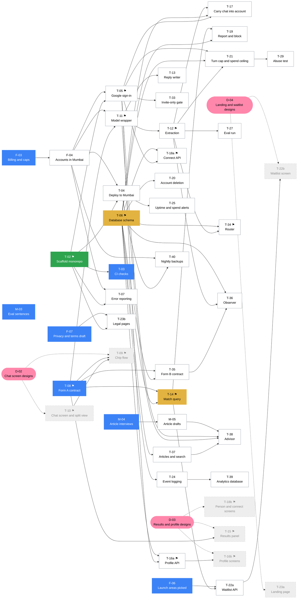

---
tags:
  - progress
---
<!-- Generated by tools/build-obsidian-plan.py. Edit docs/team-plan.json instead. -->

# Progress

**The vault is the source of truth for progress.** You can open every task
below to see its sub-tasks. These checkboxes are the list in the task note
itself. This note shows that list, and does not copy it. Thus, if you tick
a box here, you also tick the same box in the task note.

The counts and the ✅ 🟡 ⬜ marks are a snapshot. To update them, run
`python3 tools/build-obsidian-plan.py`.

**13 of 196 done · 7%**

`██░░░░░░░░░░░░░░░░░░░░░░`

This note is part of [[roomsie launch]].

| Lane | Tasks complete | Items | Done |
|---|---|---|---|
| [[P1 Platform]] | 1 / 9 | 6 / 28 | 21% |
| [[P2 Chat]] | 0 / 13 | 0 / 49 | 0% |
| [[P3 Data and trust]] | 0 / 4 | 7 / 19 | 37% |
| [[P4 Content and moderation]] | 0 / 7 | 0 / 21 | 0% |
| [[P5 Accounts and people]] | 0 / 6 | 0 / 19 | 0% |
| [[Design]] | 0 / 6 | 0 / 12 | 0% |
| [[M1 Content]] | 0 / 3 | 0 / 6 | 0% |
| [[M2 Community]] | 0 / 4 | 0 / 11 | 0% |
| [[Founder]] | 0 / 10 | 0 / 26 | 0% |
| [[Everyone]] | 0 / 2 | 0 / 5 | 0% |

---

## Design-free work

Until the designs arrive, take tasks from this section only. No task here waits on a design. This list comes from the `deps` in `docs/team-plan.json`.

- **You can start wave 0 at this time.** Its tasks wait on no open task.
- **Wave n waits on wave n−1.** When a wave is complete, you can start the next wave.
- **Many people can work on one wave.** Each person does one task at a time.
- **To take a task, assign its issue to you.** First, make sure that the issue has no assignee.
- **In a wave, take the ⚑ tasks first.** Then take the task that unblocks the most tasks.
- **When the designs arrive,** the tasks in "Waits on the designs" join the waves.

**37 design-free tasks are open · 115 build hours.**

| Wave | Task | Owner | Hours | State | Unblocks | Issue |
|---|---|---|---|---|---|---|
| 0 | [[T-06 Database schema ⚑]] | P3 | 8 | 🟡 in progress | 21 | [#11](https://github.com/magentawood/roomsie/issues/11) |
| 0 | [[T-08 Form A contract ⚑]] | P2 | 2 | ⬜ can start | 17 | [#6](https://github.com/magentawood/roomsie/issues/6) |
| 0 | [[F-03 Billing and caps]] | F |  | ⬜ can start | 22 | [#4](https://github.com/magentawood/roomsie/issues/4) |
| 0 | [[F-06 Launch areas picked]] | F |  | ⬜ can start | 5 | [#9](https://github.com/magentawood/roomsie/issues/9) |
| 0 | [[M-04 Article interviews]] | M1 |  | ⬜ can start | 2 | [#13](https://github.com/magentawood/roomsie/issues/13) |
| 0 | [[F-07 Privacy and terms draft]] | F |  | ⬜ can start | 1 | [#17](https://github.com/magentawood/roomsie/issues/17) |
| 0 | [[M-03 Eval sentences]] | P5 | 4 | ⬜ can start | 0 | [#21](https://github.com/magentawood/roomsie/issues/21) |
| 0 | [[T-03 CI checks]] | P5 | 2 | ⬜ can start | 0 | [#24](https://github.com/magentawood/roomsie/issues/24) |
| 1 | [[T-14 Match query ⚑]] | P3 | 6 | 🟡 in progress | 4 | [#27](https://github.com/magentawood/roomsie/issues/27) |
| 1 | [[F-04 Accounts in Mumbai]] | F |  | ⬜ waits | 21 | [#5](https://github.com/magentawood/roomsie/issues/5) |
| 1 | [[M-05 Article drafts]] | M1 |  | ⬜ waits | 1 | [#31](https://github.com/magentawood/roomsie/issues/31) |
| 1 | [[T-24 Event logging]] | P5 | 2 | ⬜ waits | 1 | [#37](https://github.com/magentawood/roomsie/issues/37) |
| 1 | [[T-35 Form B contract]] | P2 | 3 | ⬜ waits | 1 | [#64](https://github.com/magentawood/roomsie/issues/64) |
| 1 | [[T-37 Articles and search]] | P4 | 3 | ⬜ waits | 1 | [#66](https://github.com/magentawood/roomsie/issues/66) |
| 1 | [[T-20 Account deletion]] | P4 | 3 | ⬜ waits | 0 | [#46](https://github.com/magentawood/roomsie/issues/46) |
| 1 | [[T-23b Legal pages]] | P4 | 2 | ⬜ waits | 0 | [#40](https://github.com/magentawood/roomsie/issues/40) |
| 2 | [[T-05 Google sign-in ⚑]] | P1 | 6 | ⬜ waits | 10 | [#20](https://github.com/magentawood/roomsie/issues/20) |
| 2 | [[T-11 Model wrapper ⚑]] | P2 | 4 | ⬜ waits | 9 | [#15](https://github.com/magentawood/roomsie/issues/15) |
| 2 | [[T-04 Deploy to Mumbai]] | P1 | 3 | ⬜ waits | 2 | [#30](https://github.com/magentawood/roomsie/issues/30) |
| 2 | [[T-22a Waitlist API]] | P4 | 2 | ⬜ waits | 1 | [#47](https://github.com/magentawood/roomsie/issues/47) |
| 2 | [[T-07 Error reporting]] | P1 | 1 | ⬜ waits | 0 | [#28](https://github.com/magentawood/roomsie/issues/28) |
| 2 | [[T-19 Report and block]] | P4 | 5 | ⬜ waits | 0 | [#45](https://github.com/magentawood/roomsie/issues/45) |
| 2 | [[T-39 Analytics database]] | P1 | 3 | ⬜ waits | 0 | [#68](https://github.com/magentawood/roomsie/issues/68) |
| 3 | [[T-12 Extraction ⚑]] | P2 | 6 | ⬜ waits | 6 | [#23](https://github.com/magentawood/roomsie/issues/23) |
| 3 | [[T-16a Profile API ⚑]] | P5 | 5 | ⬜ waits | 2 | [#36](https://github.com/magentawood/roomsie/issues/36) |
| 3 | [[T-18a Connect API ⚑]] | P5 | 4 | ⬜ waits | 1 | [#38](https://github.com/magentawood/roomsie/issues/38) |
| 3 | [[T-13 Reply writer]] | P2 | 4 | ⬜ waits | 0 | [#33](https://github.com/magentawood/roomsie/issues/33) |
| 3 | [[T-25 Uptime and spend alerts]] | P1 | 2 | ⬜ waits | 0 | [#43](https://github.com/magentawood/roomsie/issues/43) |
| 3 | [[T-33 Invite-only gate]] | P1 | 1 | ⬜ waits | 0 | [#29](https://github.com/magentawood/roomsie/issues/29) |
| 3 | [[T-38 Advisor]] | P2 | 7 | ⬜ waits | 0 | [#67](https://github.com/magentawood/roomsie/issues/67) |
| 3 | [[T-40 Nightly backups]] | P1 | 2 | ⬜ waits | 0 | [#69](https://github.com/magentawood/roomsie/issues/69) |
| 4 | [[T-34 Router ⚑]] | P2 | 6 | ⬜ waits | 0 | [#63](https://github.com/magentawood/roomsie/issues/63) |
| 4 | [[T-21 Turn cap and spend ceiling]] | P2 | 5 | ⬜ waits | 1 | [#41](https://github.com/magentawood/roomsie/issues/41) |
| 4 | [[T-17 Carry chat into account]] | P2 | 2 | ⬜ waits | 0 | [#32](https://github.com/magentawood/roomsie/issues/32) |
| 4 | [[T-27 Eval run]] | P2 | 3 | ⬜ waits | 0 | [#48](https://github.com/magentawood/roomsie/issues/48) |
| 4 | [[T-36 Observer]] | P2 | 8 | ⬜ waits | 0 | [#65](https://github.com/magentawood/roomsie/issues/65) |
| 5 | [[T-29 Abuse test]] | P1 | 1 | ⬜ waits | 0 | [#51](https://github.com/magentawood/roomsie/issues/51) |

### Waits on the designs

| Task | Owner | Hours | Waits on | Issue |
|---|---|---|---|---|
| [[T-09 Chip flow ⚑]] | P2 | 6 | D-02 | [#26](https://github.com/magentawood/roomsie/issues/26) |
| [[T-10 Chat screen and split view ⚑]] | P2 | 8 | D-02 | [#12](https://github.com/magentawood/roomsie/issues/12) |
| [[T-15 Results panel ⚑]] | P3 | 6 | D-03 | [#16](https://github.com/magentawood/roomsie/issues/16) |
| [[T-16b Profile screens ⚑]] | P5 | 3 | D-03 | [#98](https://github.com/magentawood/roomsie/issues/98) |
| [[T-18b Person and connect screens ⚑]] | P3 | 4 | D-03 | [#44](https://github.com/magentawood/roomsie/issues/44) |
| [[T-22b Waitlist screen]] | P4 | 1 | D-04 | [#99](https://github.com/magentawood/roomsie/issues/99) |
| [[T-23a Landing page]] | P4 | 4 | D-04 | [#39](https://github.com/magentawood/roomsie/issues/39) |

### Graph

Blue can start. Yellow is in progress. Green is done. White waits on a different task. Grey waits on a design. Pink is a design task.

---

## P1 Platform — 6/28

> [!todo]- ✅ [[T-02 Scaffold monorepo ⚑]] · 6/6
> ![[T-02 Scaffold monorepo ⚑#^done]]

> [!todo]- ⬜ [[T-05 Google sign-in ⚑]] · 0/3
> ![[T-05 Google sign-in ⚑#^done]]

> [!todo]- ⬜ [[T-04 Deploy to Mumbai]] · 0/3
> ![[T-04 Deploy to Mumbai#^done]]

> [!todo]- ⬜ [[T-07 Error reporting]] · 0/3
> ![[T-07 Error reporting#^done]]

> [!todo]- ⬜ [[T-25 Uptime and spend alerts]] · 0/2
> ![[T-25 Uptime and spend alerts#^done]]

> [!todo]- ⬜ [[T-33 Invite-only gate]] · 0/2
> ![[T-33 Invite-only gate#^done]]

> [!todo]- ⬜ [[T-39 Analytics database]] · 0/3
> ![[T-39 Analytics database#^done]]

> [!todo]- ⬜ [[T-40 Nightly backups]] · 0/3
> ![[T-40 Nightly backups#^done]]

> [!todo]- ⬜ [[T-29 Abuse test]] · 0/3
> ![[T-29 Abuse test#^done]]

## P2 Chat — 0/49

> [!todo]- ⬜ [[T-08 Form A contract ⚑]] · 0/4
> ![[T-08 Form A contract ⚑#^done]]

> [!todo]- ⬜ [[T-11 Model wrapper ⚑]] · 0/4
> ![[T-11 Model wrapper ⚑#^done]]

> [!todo]- ⬜ [[T-35 Form B contract]] · 0/2
> ![[T-35 Form B contract#^done]]

> [!todo]- ⬜ [[T-12 Extraction ⚑]] · 0/5
> ![[T-12 Extraction ⚑#^done]]

> [!todo]- ⬜ [[T-34 Router ⚑]] · 0/4
> ![[T-34 Router ⚑#^done]]

> [!todo]- ⬜ [[T-13 Reply writer]] · 0/4
> ![[T-13 Reply writer#^done]]

> [!todo]- ⬜ [[T-36 Observer]] · 0/4
> ![[T-36 Observer#^done]]

> [!todo]- ⬜ [[T-21 Turn cap and spend ceiling]] · 0/4
> ![[T-21 Turn cap and spend ceiling#^done]]

> [!todo]- ⬜ [[T-38 Advisor]] · 0/4
> ![[T-38 Advisor#^done]]

> [!todo]- ⬜ [[T-27 Eval run]] · 0/3
> ![[T-27 Eval run#^done]]

> [!todo]- ⬜ [[T-17 Carry chat into account]] · 0/3
> ![[T-17 Carry chat into account#^done]]

> [!todo]- ⬜ [[T-10 Chat screen and split view ⚑]] · 0/5
> ![[T-10 Chat screen and split view ⚑#^done]]

> [!todo]- ⬜ [[T-09 Chip flow ⚑]] · 0/3
> ![[T-09 Chip flow ⚑#^done]]

## P3 Data and trust — 7/19

> [!todo]- 🟡 [[T-06 Database schema ⚑]] · 4/6
> ![[T-06 Database schema ⚑#^done]]

> [!todo]- 🟡 [[T-14 Match query ⚑]] · 3/4
> ![[T-14 Match query ⚑#^done]]

> [!todo]- ⬜ [[T-15 Results panel ⚑]] · 0/4
> ![[T-15 Results panel ⚑#^done]]

> [!todo]- ⬜ [[T-18b Person and connect screens ⚑]] · 0/5
> ![[T-18b Person and connect screens ⚑#^done]]

## P4 Content and moderation — 0/21

> [!todo]- ⬜ [[T-23a Landing page]] · 0/4
> ![[T-23a Landing page#^done]]

> [!todo]- ⬜ [[T-23b Legal pages]] · 0/2
> ![[T-23b Legal pages#^done]]

> [!todo]- ⬜ [[T-37 Articles and search]] · 0/3
> ![[T-37 Articles and search#^done]]

> [!todo]- ⬜ [[T-19 Report and block]] · 0/4
> ![[T-19 Report and block#^done]]

> [!todo]- ⬜ [[T-20 Account deletion]] · 0/4
> ![[T-20 Account deletion#^done]]

> [!todo]- ⬜ [[T-22a Waitlist API]] · 0/2
> ![[T-22a Waitlist API#^done]]

> [!todo]- ⬜ [[T-22b Waitlist screen]] · 0/2
> ![[T-22b Waitlist screen#^done]]

## P5 Accounts and people — 0/19

> [!todo]- ⬜ [[M-03 Eval sentences]] · 0/3
> ![[M-03 Eval sentences#^done]]

> [!todo]- ⬜ [[T-03 CI checks]] · 0/3
> ![[T-03 CI checks#^done]]

> [!todo]- ⬜ [[T-24 Event logging]] · 0/4
> ![[T-24 Event logging#^done]]

> [!todo]- ⬜ [[T-18a Connect API ⚑]] · 0/3
> ![[T-18a Connect API ⚑#^done]]

> [!todo]- ⬜ [[T-16a Profile API ⚑]] · 0/3
> ![[T-16a Profile API ⚑#^done]]

> [!todo]- ⬜ [[T-16b Profile screens ⚑]] · 0/3
> ![[T-16b Profile screens ⚑#^done]]

## Design — 0/12

> [!todo]- ⬜ [[D-01 Styling decision]] · 0/1
> ![[D-01 Styling decision#^done]]

> [!todo]- ⬜ [[D-02 Chat screen designs ⚑]] · 0/2
> ![[D-02 Chat screen designs ⚑#^done]]

> [!todo]- ⬜ [[D-03 Results and profile designs]] · 0/4
> ![[D-03 Results and profile designs#^done]]

> [!todo]- ⬜ [[D-04 Landing and waitlist designs]] · 0/2
> ![[D-04 Landing and waitlist designs#^done]]

> [!todo]- ⬜ [[D-05 Design QA]] · 0/2
> ![[D-05 Design QA#^done]]

> [!todo]- ⬜ [[D-06 Launch visuals]] · 0/1
> ![[D-06 Launch visuals#^done]]

## M1 Content — 0/6

> [!todo]- ⬜ [[M-04 Article interviews]] · 0/2
> ![[M-04 Article interviews#^done]]

> [!todo]- ⬜ [[M-05 Article drafts]] · 0/2
> ![[M-05 Article drafts#^done]]

> [!todo]- ⬜ [[M-07 Launch posts]] · 0/2
> ![[M-07 Launch posts#^done]]

## M2 Community — 0/11

> [!todo]- ⬜ [[M-01 Seeding form ⚑]] · 0/3
> ![[M-01 Seeding form ⚑#^done]]

> [!todo]- ⬜ [[M-02 100 sign-ups]] · 0/2
> ![[M-02 100 sign-ups#^done]]

> [!todo]- ⬜ [[M-06 Beta invites ⚑]] · 0/3
> ![[M-06 Beta invites ⚑#^done]]

> [!todo]- ⬜ [[M-09 Broker calls]] · 0/3
> ![[M-09 Broker calls#^done]]

## Founder — 0/26

> [!todo]- ⬜ [[F-01 Kickoff]] · 0/3
> ![[F-01 Kickoff#^done]]

> [!todo]- ⬜ [[F-02 Domain]] · 0/2
> ![[F-02 Domain#^done]]

> [!todo]- ⬜ [[F-03 Billing and caps]] · 0/2
> ![[F-03 Billing and caps#^done]]

> [!todo]- ⬜ [[F-04 Accounts in Mumbai]] · 0/4
> ![[F-04 Accounts in Mumbai#^done]]

> [!todo]- ⬜ [[F-05 Seeding consent text ⚑]] · 0/2
> ![[F-05 Seeding consent text ⚑#^done]]

> [!todo]- ⬜ [[F-06 Launch areas picked]] · 0/2
> ![[F-06 Launch areas picked#^done]]

> [!todo]- ⬜ [[F-07 Privacy and terms draft]] · 0/3
> ![[F-07 Privacy and terms draft#^done]]

> [!todo]- ⬜ [[F-09 ADR exceptions]] · 0/3
> ![[F-09 ADR exceptions#^done]]

> [!todo]- ⬜ [[F-08 Moderator named]] · 0/3
> ![[F-08 Moderator named#^done]]

> [!todo]- ⬜ [[F-10 Go-no-go meeting]] · 0/2
> ![[F-10 Go-no-go meeting#^done]]

## Everyone — 0/5

> [!todo]- ⬜ [[A-01 Bug fix day]] · 0/2
> ![[A-01 Bug fix day#^done]]

> [!todo]- ⬜ [[A-02 Launch day]] · 0/3
> ![[A-02 Launch day#^done]]

