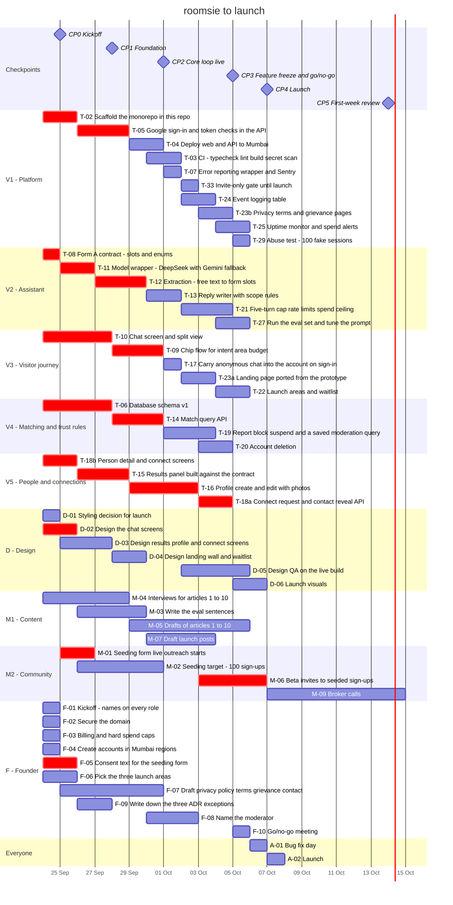

# Team plan: launch on 7 October

**Date:** 2026-09-23 · **Status:** ready to assign · **Decision:** D12

Every task below is also a GitHub issue, grouped into one milestone per checkpoint. This file is the baseline. The issues are the live tracker.

---

## How to use this

1. **Put a name against every vertical and role.** Task F-01. They are slots, so the plan works before anyone is named.
2. **Pick a vertical and assign yourself** to the issues with its label, for example `vertical:V4 matching`.
3. **Work your list in order.** The order is the schedule. Finish and merge one task before starting the next.
4. **Post a standup by 10 am:** what you finished, what you're on, what's blocking you.
5. **Blocked for more than half a day?** Say so in the channel. The founder reassigns.

**Everyone works two hours a day, weekends included, from Thursday 24 September.** The plan has no margin. That is why the fallback date exists.

---

## Five verticals

Each engineer owns one slice of the product, from the database to the screen. Pick one and put your name against it.

| Vertical | Question it answers | Owns | Hours to 5 Oct | Spare | Person |
|---|---|---|---|---|---|
| **V1 · Platform** | The ground everyone builds on | Code base, CI, deploy, Google sign-in, error reporting, invite gate, event logging, alerts, legal pages, abuse test | 24 | 0 | _name_ |
| **V2 · Assistant** | What the assistant understands and says | Form contract, model wrapper, extraction, replies, turn cap and spend ceiling, eval | 24 | 0 | _name_ |
| **V3 · Visitor journey** | From landing to signed in | Landing page, chat screen and split view, chips, carrying the chat into the account, launch areas and waitlist | 23 | 1 | _name_ |
| **V4 · Matching and trust rules** | Who sees whom | Database schema, match query, report, block and suspend, account deletion | 22 | 2 | _name_ |
| **V5 · People and connections** | The people on the screen | Results panel, profile and photos, person screen, connect and contact reveal | 22 | 2 | _name_ |

Each engineer has 24 hours from Thursday 24 September to Monday 5 October, at two hours a day. Tuesday 6 October is bug fixing. Wednesday 7 October is launch.

**Why the conversation is two verticals.** The assistant's logic and the chat screens together are about 38 hours. That is more than one person has. So V2 owns what the assistant understands and says, and V3 owns what the visitor sees. They meet at the Form A contract, which V2 writes on day one.

**How verticals share the early days.** Nobody can wait for someone else's slice. So V3 and V5 build their screens from the V3 prototype and the Form A contract, with sample data, and wire them to the real API when it lands. Each person's list below already has this order.

**Other roles.** Design, marketing and the founder keep their roles. Their sequences are below too.

**If there are four engineers, not five,** one vertical has no owner, and its 22 to 24 hours has nowhere to go. Plan for 9 October from day one, and use the cut order in `docs/launch-plan.md`.

---

## Each person's sequence

Work top to bottom. Finish and merge one task before starting the next. Dates assume two hours every day.

### V1 · Platform — the ground everyone builds on

| # | Task | Hours | When | Waits on |
|---|---|---|---|---|
| 1 | T-02 ⚑ · Scaffold the monorepo in this repo | 4 | Thu 24 Sep → Fri 25 Sep | — |
| 2 | T-05 ⚑ · Google sign-in and token checks in the API | 6 | Sat 26 Sep → Mon 28 Sep | T-02 |
| 3 | T-04 · Deploy web and API to Mumbai | 3 | Tue 29 Sep → Wed 30 Sep | T-02 |
| 4 | T-03 · CI: typecheck, lint, build, secret scan | 2 | Wed 30 Sep → Thu 1 Oct | T-02 |
| 5 | T-07 · Error reporting wrapper and Sentry | 1 | Thu 1 Oct | T-02 |
| 6 | T-33 · Invite-only gate until launch | 1 | Fri 2 Oct | T-05 |
| 7 | T-24 · Event logging table | 2 | Fri 2 Oct → Sat 3 Oct | T-06 |
| 8 | T-23b · Privacy, terms and grievance pages | 2 | Sat 3 Oct → Sun 4 Oct | T-02 |
| 9 | T-25 · Uptime monitor and spend alerts | 2 | Sun 4 Oct → Mon 5 Oct | T-04 |
| 10 | T-29 · Abuse test: 100 fake sessions | 1 | Mon 5 Oct | T-21 |

Finish line: Mon 5 Oct. 0 spare hours.

### V2 · Assistant — what the assistant understands and says

| # | Task | Hours | When | Waits on |
|---|---|---|---|---|
| 1 | T-08 ⚑ · Form A contract: slots and enums | 2 | Thu 24 Sep | — |
| 2 | T-11 ⚑ · Model wrapper: DeepSeek with Gemini fallback | 4 | Fri 25 Sep → Sat 26 Sep | T-08 |
| 3 | T-12 ⚑ · Extraction: free text to form slots | 6 | Sun 27 Sep → Tue 29 Sep | T-11 |
| 4 | T-13 · Reply writer with scope rules | 4 | Wed 30 Sep → Thu 1 Oct | T-11 |
| 5 | T-21 · Five-turn cap, rate limits, spend ceiling | 5 | Fri 2 Oct → Sun 4 Oct | T-12 |
| 6 | T-27 · Run the eval set and tune the prompt | 3 | Sun 4 Oct → Mon 5 Oct | T-12 |

Finish line: Mon 5 Oct. 0 spare hours.

### V3 · Visitor journey — from landing to signed in

| # | Task | Hours | When | Waits on |
|---|---|---|---|---|
| 1 | T-10 ⚑ · Chat screen and split view | 8 | Thu 24 Sep → Sun 27 Sep | — |
| 2 | T-09 ⚑ · Chip flow for intent, area, budget | 6 | Mon 28 Sep → Wed 30 Sep | T-10, T-08 |
| 3 | T-17 · Carry anonymous chat into the account on sign-in | 2 | Thu 1 Oct | T-05, T-06 |
| 4 | T-23a · Landing page ported from the prototype | 4 | Fri 2 Oct → Sat 3 Oct | — |
| 5 | T-22 · Launch areas and waitlist | 3 | Sun 4 Oct → Mon 5 Oct | T-14 |

Finish line: Mon 5 Oct. 1 spare hour.

### V4 · Matching and trust rules — who sees whom

| # | Task | Hours | When | Waits on |
|---|---|---|---|---|
| 1 | T-06 ⚑ · Database schema v1 | 8 | Thu 24 Sep → Sun 27 Sep | — |
| 2 | T-14 ⚑ · Match query API | 6 | Mon 28 Sep → Wed 30 Sep | T-06, T-08 |
| 3 | T-19 · Report, block, suspend, and a saved moderation query | 5 | Thu 1 Oct → Sat 3 Oct | T-06 |
| 4 | T-20 · Account deletion | 3 | Sat 3 Oct → Sun 4 Oct | T-06 |

Finish line: Sun 4 Oct. 2 spare hours.

### V5 · People and connections — the people on the screen

| # | Task | Hours | When | Waits on |
|---|---|---|---|---|
| 1 | T-18b ⚑ · Person detail and connect screens | 4 | Thu 24 Sep → Fri 25 Sep | nothing yet. Wire to T-18a on Sun 4 Oct |
| 2 | T-15 ⚑ · Results panel, built against the contract | 6 | Sat 26 Sep → Mon 28 Sep | T-08. Wire to T-14 on Wed 30 Sep |
| 3 | T-16 ⚑ · Profile create and edit, with photos | 8 | Tue 29 Sep → Fri 2 Oct | T-05, T-06 |
| 4 | T-18a ⚑ · Connect request and contact reveal API | 4 | Sat 3 Oct → Sun 4 Oct | T-05, T-06 |

Finish line: Sun 4 Oct. 2 spare hours.

### D · Design

| # | Task | When | Waits on |
|---|---|---|---|
| 1 | D-01 · Styling decision for launch | Thu 24 Sep | — |
| 2 | D-02 ⚑ · Design the chat screens | Thu 24 Sep → Fri 25 Sep | D-01 |
| 3 | D-03 · Design results, profile and connect screens | Fri 25 Sep → Sun 27 Sep | D-01 |
| 4 | D-04 · Design landing, wall and waitlist | Mon 28 Sep → Tue 29 Sep | D-01 |
| 5 | D-05 · Design QA on the live build | Fri 2 Oct → Mon 5 Oct | D-02, D-03 |
| 6 | D-06 · Launch visuals | Mon 5 Oct → Tue 6 Oct | — |

Finish line: Tue 6 Oct.

### M1 · Content

| # | Task | When | Waits on |
|---|---|---|---|
| 1 | M-04 · Interviews for articles 1 to 10 | Thu 24 Sep → Mon 28 Sep | — |
| 2 | M-03 · Write the eval sentences | Sat 26 Sep → Tue 29 Sep | — |
| 3 | M-05 · Drafts of articles 1 to 10 | Tue 29 Sep → Mon 5 Oct | M-04 |
| 4 | M-07 · Draft launch posts | Wed 30 Sep → Sat 3 Oct | — |

Finish line: Mon 5 Oct.

### M2 · Community

| # | Task | When | Waits on |
|---|---|---|---|
| 1 | M-01 ⚑ · Seeding form live, outreach starts | Fri 25 Sep → Sat 26 Sep | F-05, F-06 |
| 2 | M-02 · Seeding target: 100 sign-ups | Sat 26 Sep → Wed 30 Sep | M-01 |
| 3 | M-06 ⚑ · Beta invites to seeded sign-ups | Sat 3 Oct → Tue 6 Oct | M-02, T-16 |
| 4 | M-09 · Broker calls | Wed 7 Oct → Wed 14 Oct | — |

Finish line: Wed 14 Oct.

### F · Founder

| # | Task | When | Waits on |
|---|---|---|---|
| 1 | F-01 · Kickoff: names on every role | Thu 24 Sep | — |
| 2 | F-02 · Secure the domain | Thu 24 Sep | — |
| 3 | F-03 · Billing and hard spend caps | Thu 24 Sep | — |
| 4 | F-04 · Create accounts in Mumbai regions | Thu 24 Sep | F-03 |
| 5 | F-05 ⚑ · Consent text for the seeding form | Thu 24 Sep → Fri 25 Sep | — |
| 6 | F-06 · Pick the three launch areas | Thu 24 Sep → Fri 25 Sep | — |
| 7 | F-07 · Draft privacy policy, terms, grievance contact | Fri 25 Sep → Wed 30 Sep | — |
| 8 | F-09 · Write down the three ADR exceptions | Sat 26 Sep → Sun 27 Sep | — |
| 9 | F-08 · Name the moderator | Wed 30 Sep → Fri 2 Oct | — |
| 10 | F-10 · Go/no-go meeting | Mon 5 Oct | — |

Finish line: Mon 5 Oct.

Everyone: Tuesday 6 October is bug fixing, task A-01. Wednesday 7 October is launch, task A-02.

---

## All tasks

One row per task, grouped by owner in the order they are worked. ⚑ marks the critical path.

| Owner | # | ID | Task | Hours | Start | End | Checkpoint | Waits on | Issue |
|---|---|---|---|---|---|---|---|---|---|
| V1 Platform | 1 | T-02 ⚑ | Scaffold the monorepo in this repo | 4 | Thu 24 Sep | Fri 25 Sep | CP0 | — | [#10](https://github.com/magentawood/roomsie/issues/10) |
| V1 Platform | 2 | T-05 ⚑ | Google sign-in and token checks in the API | 6 | Sat 26 Sep | Mon 28 Sep | CP1 | T-02 | [#20](https://github.com/magentawood/roomsie/issues/20) |
| V1 Platform | 3 | T-04 | Deploy web and API to Mumbai | 3 | Tue 29 Sep | Wed 30 Sep | CP2 | T-02 | [#30](https://github.com/magentawood/roomsie/issues/30) |
| V1 Platform | 4 | T-03 | CI: typecheck, lint, build, secret scan | 2 | Wed 30 Sep | Thu 1 Oct | CP2 | T-02 | [#24](https://github.com/magentawood/roomsie/issues/24) |
| V1 Platform | 5 | T-07 | Error reporting wrapper and Sentry | 1 | Thu 1 Oct | Thu 1 Oct | CP2 | T-02 | [#28](https://github.com/magentawood/roomsie/issues/28) |
| V1 Platform | 6 | T-33 | Invite-only gate until launch | 1 | Fri 2 Oct | Fri 2 Oct | CP3 | T-05 | [#29](https://github.com/magentawood/roomsie/issues/29) |
| V1 Platform | 7 | T-24 | Event logging table | 2 | Fri 2 Oct | Sat 3 Oct | CP3 | T-06 | [#37](https://github.com/magentawood/roomsie/issues/37) |
| V1 Platform | 8 | T-23b | Privacy, terms and grievance pages | 2 | Sat 3 Oct | Sun 4 Oct | CP3 | T-02 | [#40](https://github.com/magentawood/roomsie/issues/40) |
| V1 Platform | 9 | T-25 | Uptime monitor and spend alerts | 2 | Sun 4 Oct | Mon 5 Oct | CP3 | T-04 | [#43](https://github.com/magentawood/roomsie/issues/43) |
| V1 Platform | 10 | T-29 | Abuse test: 100 fake sessions | 1 | Mon 5 Oct | Mon 5 Oct | CP3 | T-21 | [#51](https://github.com/magentawood/roomsie/issues/51) |
| V2 Assistant | 1 | T-08 ⚑ | Form A contract: slots and enums | 2 | Thu 24 Sep | Thu 24 Sep | CP0 | — | [#6](https://github.com/magentawood/roomsie/issues/6) |
| V2 Assistant | 2 | T-11 ⚑ | Model wrapper: DeepSeek with Gemini fallback | 4 | Fri 25 Sep | Sat 26 Sep | CP1 | T-08 | [#15](https://github.com/magentawood/roomsie/issues/15) |
| V2 Assistant | 3 | T-12 ⚑ | Extraction: free text to form slots | 6 | Sun 27 Sep | Tue 29 Sep | CP2 | T-11 | [#23](https://github.com/magentawood/roomsie/issues/23) |
| V2 Assistant | 4 | T-13 | Reply writer with scope rules | 4 | Wed 30 Sep | Thu 1 Oct | CP2 | T-11 | [#33](https://github.com/magentawood/roomsie/issues/33) |
| V2 Assistant | 5 | T-21 | Five-turn cap, rate limits, spend ceiling | 5 | Fri 2 Oct | Sun 4 Oct | CP3 | T-12 | [#41](https://github.com/magentawood/roomsie/issues/41) |
| V2 Assistant | 6 | T-27 | Run the eval set and tune the prompt | 3 | Sun 4 Oct | Mon 5 Oct | CP3 | T-12 | [#48](https://github.com/magentawood/roomsie/issues/48) |
| V3 Visitor | 1 | T-10 ⚑ | Chat screen and split view | 8 | Thu 24 Sep | Sun 27 Sep | CP1 | — | [#12](https://github.com/magentawood/roomsie/issues/12) |
| V3 Visitor | 2 | T-09 ⚑ | Chip flow for intent, area, budget | 6 | Mon 28 Sep | Wed 30 Sep | CP2 | T-10, T-08 | [#26](https://github.com/magentawood/roomsie/issues/26) |
| V3 Visitor | 3 | T-17 | Carry anonymous chat into the account on sign-in | 2 | Thu 1 Oct | Thu 1 Oct | CP2 | T-05, T-06 | [#32](https://github.com/magentawood/roomsie/issues/32) |
| V3 Visitor | 4 | T-23a | Landing page ported from the prototype | 4 | Fri 2 Oct | Sat 3 Oct | CP3 | — | [#39](https://github.com/magentawood/roomsie/issues/39) |
| V3 Visitor | 5 | T-22 | Launch areas and waitlist | 3 | Sun 4 Oct | Mon 5 Oct | CP3 | T-14 | [#47](https://github.com/magentawood/roomsie/issues/47) |
| V4 Matching | 1 | T-06 ⚑ | Database schema v1 | 8 | Thu 24 Sep | Sun 27 Sep | CP1 | — | [#11](https://github.com/magentawood/roomsie/issues/11) |
| V4 Matching | 2 | T-14 ⚑ | Match query API | 6 | Mon 28 Sep | Wed 30 Sep | CP2 | T-06, T-08 | [#27](https://github.com/magentawood/roomsie/issues/27) |
| V4 Matching | 3 | T-19 | Report, block, suspend, and a saved moderation query | 5 | Thu 1 Oct | Sat 3 Oct | CP3 | T-06 | [#45](https://github.com/magentawood/roomsie/issues/45) |
| V4 Matching | 4 | T-20 | Account deletion | 3 | Sat 3 Oct | Sun 4 Oct | CP3 | T-06 | [#46](https://github.com/magentawood/roomsie/issues/46) |
| V5 People | 1 | T-18b ⚑ | Person detail and connect screens | 4 | Thu 24 Sep | Fri 25 Sep | CP0 | — (T-18a later) | [#44](https://github.com/magentawood/roomsie/issues/44) |
| V5 People | 2 | T-15 ⚑ | Results panel, built against the contract | 6 | Sat 26 Sep | Mon 28 Sep | CP1 | T-08 | [#16](https://github.com/magentawood/roomsie/issues/16) |
| V5 People | 3 | T-16 ⚑ | Profile create and edit, with photos | 8 | Tue 29 Sep | Fri 2 Oct | CP3 | T-05, T-06 | [#36](https://github.com/magentawood/roomsie/issues/36) |
| V5 People | 4 | T-18a ⚑ | Connect request and contact reveal API | 4 | Sat 3 Oct | Sun 4 Oct | CP3 | T-05, T-06 | [#38](https://github.com/magentawood/roomsie/issues/38) |
| Design | 1 | D-01 | Styling decision for launch |  | Thu 24 Sep | Thu 24 Sep | CP0 | — | [#1](https://github.com/magentawood/roomsie/issues/1) |
| Design | 2 | D-02 ⚑ | Design the chat screens |  | Thu 24 Sep | Fri 25 Sep | CP0 | D-01 | [#7](https://github.com/magentawood/roomsie/issues/7) |
| Design | 3 | D-03 | Design results, profile and connect screens |  | Fri 25 Sep | Sun 27 Sep | CP1 | D-01 | [#19](https://github.com/magentawood/roomsie/issues/19) |
| Design | 4 | D-04 | Design landing, wall and waitlist |  | Mon 28 Sep | Tue 29 Sep | CP2 | D-01 | [#25](https://github.com/magentawood/roomsie/issues/25) |
| Design | 5 | D-05 | Design QA on the live build |  | Fri 2 Oct | Mon 5 Oct | CP3 | D-02, D-03 | [#42](https://github.com/magentawood/roomsie/issues/42) |
| Design | 6 | D-06 | Launch visuals |  | Mon 5 Oct | Tue 6 Oct | CP4 | — | [#52](https://github.com/magentawood/roomsie/issues/52) |
| M1 Content | 1 | M-04 | Interviews for articles 1 to 10 |  | Thu 24 Sep | Mon 28 Sep | CP1 | — | [#13](https://github.com/magentawood/roomsie/issues/13) |
| M1 Content | 2 | M-03 | Write the eval sentences |  | Sat 26 Sep | Tue 29 Sep | CP2 | — | [#21](https://github.com/magentawood/roomsie/issues/21) |
| M1 Content | 3 | M-05 | Drafts of articles 1 to 10 |  | Tue 29 Sep | Mon 5 Oct | CP3 | M-04 | [#31](https://github.com/magentawood/roomsie/issues/31) |
| M1 Content | 4 | M-07 | Draft launch posts |  | Wed 30 Sep | Sat 3 Oct | CP3 | — | [#35](https://github.com/magentawood/roomsie/issues/35) |
| M2 Community | 1 | M-01 ⚑ | Seeding form live, outreach starts |  | Fri 25 Sep | Sat 26 Sep | CP1 | F-05, F-06 | [#14](https://github.com/magentawood/roomsie/issues/14) |
| M2 Community | 2 | M-02 | Seeding target: 100 sign-ups |  | Sat 26 Sep | Wed 30 Sep | CP2 | M-01 | [#22](https://github.com/magentawood/roomsie/issues/22) |
| M2 Community | 3 | M-06 ⚑ | Beta invites to seeded sign-ups |  | Sat 3 Oct | Tue 6 Oct | CP4 | M-02, T-16 | [#49](https://github.com/magentawood/roomsie/issues/49) |
| M2 Community | 4 | M-09 | Broker calls |  | Wed 7 Oct | Wed 14 Oct | CP5 | — | [#55](https://github.com/magentawood/roomsie/issues/55) |
| Founder | 1 | F-01 | Kickoff: names on every role |  | Thu 24 Sep | Thu 24 Sep | CP0 | — | [#2](https://github.com/magentawood/roomsie/issues/2) |
| Founder | 2 | F-02 | Secure the domain |  | Thu 24 Sep | Thu 24 Sep | CP0 | — | [#3](https://github.com/magentawood/roomsie/issues/3) |
| Founder | 3 | F-03 | Billing and hard spend caps |  | Thu 24 Sep | Thu 24 Sep | CP0 | — | [#4](https://github.com/magentawood/roomsie/issues/4) |
| Founder | 4 | F-04 | Create accounts in Mumbai regions |  | Thu 24 Sep | Thu 24 Sep | CP0 | F-03 | [#5](https://github.com/magentawood/roomsie/issues/5) |
| Founder | 5 | F-05 ⚑ | Consent text for the seeding form |  | Thu 24 Sep | Fri 25 Sep | CP0 | — | [#8](https://github.com/magentawood/roomsie/issues/8) |
| Founder | 6 | F-06 | Pick the three launch areas |  | Thu 24 Sep | Fri 25 Sep | CP0 | — | [#9](https://github.com/magentawood/roomsie/issues/9) |
| Founder | 7 | F-07 | Draft privacy policy, terms, grievance contact |  | Fri 25 Sep | Wed 30 Sep | CP2 | — | [#17](https://github.com/magentawood/roomsie/issues/17) |
| Founder | 8 | F-09 | Write down the three ADR exceptions |  | Sat 26 Sep | Sun 27 Sep | CP1 | — | [#18](https://github.com/magentawood/roomsie/issues/18) |
| Founder | 9 | F-08 | Name the moderator |  | Wed 30 Sep | Fri 2 Oct | CP3 | — | [#34](https://github.com/magentawood/roomsie/issues/34) |
| Founder | 10 | F-10 | Go/no-go meeting |  | Mon 5 Oct | Mon 5 Oct | CP3 | — | [#50](https://github.com/magentawood/roomsie/issues/50) |
| Everyone | 1 | A-01 | Bug fix day |  | Tue 6 Oct | Tue 6 Oct | CP4 | — | [#53](https://github.com/magentawood/roomsie/issues/53) |
| Everyone | 2 | A-02 | Launch |  | Wed 7 Oct | Wed 7 Oct | CP4 | — | [#54](https://github.com/magentawood/roomsie/issues/54) |

---

## Checkpoints

| | Date | What is true by then |
|---|---|---|
| **CP0 · Kickoff** | Fri 25 Sep | Every role has a name. Accounts and billing are live. Styling is decided. Launch areas are picked. Seeding consent text is ready. The core screens are designed. |
| **CP1 · Foundation** | Mon 28 Sep | The monorepo, the schema, sign-in, CI and the model wrapper are merged. The chat screen and results panel are built. Article interviews are done. The seeding form is live. |
| **CP2 · Core loop live** | Thu 1 Oct | Deployed in Mumbai. A visitor taps chips, types a sentence the assistant understands, and sees matching test profiles. The reply writer is merged. 100 seeding sign-ups. The eval sentences are written. |
| **CP3 · Feature freeze and go/no-go** | Mon 5 Oct | Every feature is merged and live behind the invite gate. Seeded people are creating profiles. The go/no-go meeting at 8 pm decides 7 October or 9 October. |
| **CP4 · Launch** | Wed 7 Oct | Public launch. Fallback Friday 9 October. |
| **CP5 · First-week review** | Wed 14 Oct | Look at the numbers and the bug list, and set the order of v1. |

---

## Sequence

Red bars are the critical path. If one of those slips, the launch slips.

---

## Tasks by checkpoint

### CP0 · Kickoff — Fri 25 Sep

Every role has a name. Accounts and billing are live. Styling is decided. Launch areas are picked. Seeding consent text is ready. The core screens are designed.

| ID | Task | Role | Hours | When | Needs first |
|---|---|---|---|---|---|
| D-01 | Styling decision for launch | D |  | Thu 24 Sep | — |
| F-01 | Kickoff: names on every role | F |  | Thu 24 Sep | — |
| F-02 | Secure the domain | F |  | Thu 24 Sep | — |
| F-03 | Billing and hard spend caps | F |  | Thu 24 Sep | — |
| F-04 | Create accounts in Mumbai regions | F |  | Thu 24 Sep | F-03 |
| T-08 ⚑ | Form A contract: slots and enums | V2 | 2 | Thu 24 Sep | — |
| D-02 ⚑ | Design the chat screens | D |  | Thu 24 Sep → Fri 25 Sep | D-01 |
| F-05 ⚑ | Consent text for the seeding form | F |  | Thu 24 Sep → Fri 25 Sep | — |
| F-06 | Pick the three launch areas | F |  | Thu 24 Sep → Fri 25 Sep | — |
| T-02 ⚑ | Scaffold the monorepo in this repo | V1 | 4 | Thu 24 Sep → Fri 25 Sep | — |
| T-18b ⚑ | Person detail and connect screens | V5 | 4 | Thu 24 Sep → Fri 25 Sep | — |

**D-01 · Styling decision for launch** — done when:
- Launch uses the V3 prototype's look, not the Untitled UI pipeline
- Every women-only line is marked for removal
- Read first: `docs/launch-plan.md`

**F-01 · Kickoff: names on every role** — done when:
- Every role in this plan has a person's name
- Everyone has access to the repo and the issues
- Team channel exists, with a written standup by 10 am daily
- Read first: `docs/team-plan.md`

**F-02 · Secure the domain** — done when:
- roomsie.com, or the chosen alternative, is owned
- DNS access is shared with T4

**F-03 · Billing and hard spend caps** — done when:
- Billing is on for Supabase Pro, Fly, Vercel, Cloudflare, DeepSeek and Gemini
- Hard monthly caps are set on both AI accounts
- Read first: `docs/cost-and-team.md`

**F-04 · Create accounts in Mumbai regions** — done when:
- Supabase in ap-south-1, Fly in bom, Vercel functions in bom1
- Firebase project, R2 buckets for public photos and private files, DeepSeek and Gemini keys
- Keys shared through a password manager, never in chat or the repo
- Read first: `docs/source/decisions/0009-hosting-and-region.md`

**T-08 · Form A contract: slots and enums** — done when:
- A Zod schema in packages/contract for Form A
- Intent, areas, budget, move date, and the nine lifestyle answers, each with value, weight and source: stated, inferred, default or empty
- Every enum has an `unclear` value
- Read first: `docs/agent-architecture.md`, `docs/ai-agent-design.md`

**D-02 · Design the chat screens** — done when:
- Chat with chips, the split view, and the phone chat bar
- These have no prototype equivalent, and V3 starts building them on Thursday
- Read first: `docs/interface-shape.md`

**F-05 · Consent text for the seeding form** — done when:
- Says what is collected, that the profile will be shown to other roomsie users, and how to delete it
- Short enough to read on a phone

**F-06 · Pick the three launch areas** — done when:
- Three areas chosen with marketing
- Chosen by where the team can actually reach people
- Read first: `docs/launch-plan.md`

**T-02 · Scaffold the monorepo in this repo** — done when:
- pnpm workspaces and Turborepo, per ADR 0010
- apps/web on Next 16, React 19, Tailwind v4. apps/api on Fastify, Zod, Drizzle
- packages/contract and packages/config exist
- `pnpm dev` runs web and API locally. docs/ and session/ are untouched
- Read first: `docs/source/decisions/0010-monorepo-tooling.md`, `docs/source/decisions/0003-api-as-separate-service.md`

**T-18b · Person detail and connect screens** — done when:
- Built first from the V3 prototype's detail sheet, against a mock of the connect API. Wired to T-18a when it lands on Sun 4 Oct
- The person screen needs sign-in
- Connect button with sent, accepted and declined states
- The number shows only after both accept
- Report and block are one tap away

### CP1 · Foundation — Mon 28 Sep

The monorepo, the schema, sign-in, CI and the model wrapper are merged. The chat screen and results panel are built. Article interviews are done. The seeding form is live.

| ID | Task | Role | Hours | When | Needs first |
|---|---|---|---|---|---|
| T-06 ⚑ | Database schema v1 | V4 | 8 | Thu 24 Sep → Sun 27 Sep | — |
| T-10 ⚑ | Chat screen and split view | V3 | 8 | Thu 24 Sep → Sun 27 Sep | — |
| M-04 | Interviews for articles 1 to 10 | M1 |  | Thu 24 Sep → Mon 28 Sep | — |
| M-01 ⚑ | Seeding form live, outreach starts | M2 |  | Fri 25 Sep → Sat 26 Sep | F-05, F-06 |
| T-11 ⚑ | Model wrapper: DeepSeek with Gemini fallback | V2 | 4 | Fri 25 Sep → Sat 26 Sep | T-08 |
| D-03 | Design results, profile and connect screens | D |  | Fri 25 Sep → Sun 27 Sep | D-01 |
| F-09 | Write down the three ADR exceptions | F |  | Sat 26 Sep → Sun 27 Sep | — |
| T-05 ⚑ | Google sign-in and token checks in the API | V1 | 6 | Sat 26 Sep → Mon 28 Sep | T-02 |
| T-15 ⚑ | Results panel, built against the contract | V5 | 6 | Sat 26 Sep → Mon 28 Sep | T-08 |

**T-06 · Database schema v1** — done when:
- Committed migrations for users, profiles, anonymous sessions, connection requests, reports, blocks, events and waitlist
- Profiles hold intent, budget, areas, move date, the nine lifestyle answers with prefer or dealbreaker, photo keys and visibility
- UUIDv7 ids with no database default. `created_at` from the server clock
- Read first: `docs/source/decisions/0015-primary-key-strategy.md`, `docs/source/decisions/0006-drizzle.md`, `docs/agent-architecture.md`

**T-10 · Chat screen and split view** — done when:
- The landing button opens a full-screen chat
- The screen splits into chat and results once results exist
- On a phone, the chat drops to a bar at the bottom and expands on tap
- Nothing resizes while the person is typing
- Read first: `docs/interface-shape.md`

**M-04 · Interviews for articles 1 to 10** — done when:
- Three to five real people interviewed for each topic group
- Notes saved
- Read first: `docs/content/corpus-plan.md`

**M-01 · Seeding form live, outreach starts** — done when:
- Form live with the consent text
- Outreach through own networks, college and company groups, and flat-hunting groups
- Invite people to sign up. Never copy anyone's posts or details
- Read first: `docs/launch-plan.md`

**T-11 · Model wrapper: DeepSeek with Gemini fallback** — done when:
- One module is the only way the app calls a model
- DeepSeek V4.1 Flash first. Gemini on a timeout, a 5xx or a rate limit
- Output that fails Zod retries once, then goes to Gemini
- Logs tokens in, tokens out and the model for every call. The system prompt is cached
- Read first: `docs/model-selection.md`

**D-03 · Design results, profile and connect screens** — done when:
- Results panel header states and the person card, for V5 on Sat 26 Sep
- Profile create and edit with photo upload, for V5 on Tue 29 Sep
- Connect and report states, refining the prototype detail sheet V5 builds first
- Delete confirmation

**F-09 · Write down the three ADR exceptions** — done when:
- 0011: prototype styling for launch
- 0012: one events table instead of a second database
- 0014: Sentry free tier instead of GlitchTip
- Read first: `docs/launch-plan.md`

**T-05 · Google sign-in and token checks in the API** — done when:
- Google sign-in through Firebase on the web, token held in memory
- The API verifies the ID token locally, with no call to Firebase
- A users row is created on first sign-in. `tokens_valid_after` is in the first migration
- Read first: `docs/source/decisions/0007-web-rendering-and-auth-transport.md`, `docs/source/decisions/0005-managed-platform-split.md`

**T-15 · Results panel, built against the contract** — done when:
- A grid of person cards, built from the prototype's cards against the Form A contract with sample data, then wired to the match query, T-14, when it lands
- The header says what is shown, from Everything in Mumbai down to People in Powai under 20k
- Updates only when a form value or weight changes, never reorders while scrolling
- Match score hidden until lifestyle answers exist
- Read first: `docs/interface-shape.md`

### CP2 · Core loop live — Thu 1 Oct

Deployed in Mumbai. A visitor taps chips, types a sentence the assistant understands, and sees matching test profiles. The reply writer is merged. 100 seeding sign-ups. The eval sentences are written.

| ID | Task | Role | Hours | When | Needs first |
|---|---|---|---|---|---|
| F-07 | Draft privacy policy, terms, grievance contact | F |  | Fri 25 Sep → Wed 30 Sep | — |
| M-03 | Write the eval sentences | M1 |  | Sat 26 Sep → Tue 29 Sep | — |
| M-02 | Seeding target: 100 sign-ups | M2 |  | Sat 26 Sep → Wed 30 Sep | M-01 |
| T-12 ⚑ | Extraction: free text to form slots | V2 | 6 | Sun 27 Sep → Tue 29 Sep | T-11 |
| D-04 | Design landing, wall and waitlist | D |  | Mon 28 Sep → Tue 29 Sep | D-01 |
| T-09 ⚑ | Chip flow for intent, area, budget | V3 | 6 | Mon 28 Sep → Wed 30 Sep | T-10, T-08 |
| T-14 ⚑ | Match query API | V4 | 6 | Mon 28 Sep → Wed 30 Sep | T-06, T-08 |
| T-04 | Deploy web and API to Mumbai | V1 | 3 | Tue 29 Sep → Wed 30 Sep | T-02 |
| T-03 | CI: typecheck, lint, build, secret scan | V1 | 2 | Wed 30 Sep → Thu 1 Oct | T-02 |
| T-13 | Reply writer with scope rules | V2 | 4 | Wed 30 Sep → Thu 1 Oct | T-11 |
| T-07 | Error reporting wrapper and Sentry | V1 | 1 | Thu 1 Oct | T-02 |
| T-17 | Carry anonymous chat into the account on sign-in | V3 | 2 | Thu 1 Oct | T-05, T-06 |

**F-07 · Draft privacy policy, terms, grievance contact** — done when:
- Says what is collected, why, for how long, how to delete, and who to contact
- A named grievance contact

**M-03 · Write the eval sentences** — done when:
- 50 sentences people would really type, in English, Hinglish and Marathi
- Mumbai areas, 20k, bees hazaar, next month end
- 10 deliberately vague ones. T1 labels the right answers
- Read first: `docs/model-selection.md`

**M-02 · Seeding target: 100 sign-ups** — done when:
- 100 sign-ups by Wednesday 30 September
- 250 by Sunday 4 October, because about 6 in 10 will finish a profile

**T-12 · Extraction: free text to form slots** — done when:
- Free text becomes Form A slots, as JSON limited to the enums
- The Mumbai area list and number and date forms are in the cached prompt
- Numbers and dates are parsed by code, not by the model
- Anything vague becomes `unclear`, never a guess. An inferred value never fills a slot silently
- Read first: `docs/research/hinglish-model-report.md`, `docs/agent-architecture.md`

**D-04 · Design landing, wall and waitlist** — done when:
- Landing page for all genders
- Legal page template, the sign-in wall, the waitlist, empty states

**T-09 · Chip flow for intent, area, budget** — done when:
- Intent as four cards, area as the top six plus search, budget as bands
- Each tap writes to the form. A tap never calls a model
- Typing instead of tapping still works
- Read first: `docs/interface-shape.md`

**T-14 · Match query API** — done when:
- Returns matching people for a form state
- Hard filters: area, budget, move date, compatible intent, dealbreakers
- Match score is 70 plus 30 times the share of preferences met, shown only once lifestyle answers exist
- Blocked and suspended people never appear
- Read first: `docs/interface-shape.md`

**T-04 · Deploy web and API to Mumbai** — done when:
- Web on Vercel pinned to bom1. API on Fly in bom from a Dockerfile
- Secrets set in both
- A merge to main deploys automatically
- Read first: `docs/source/decisions/0009-hosting-and-region.md`

**T-03 · CI: typecheck, lint, build, secret scan** — done when:
- Every pull request runs typecheck, lint, build and gitleaks
- Finishes in under five minutes
- Read first: `docs/source/decisions/0013-ci-gate-and-testing.md`

**T-13 · Reply writer with scope rules** — done when:
- Writes the reply from the form and the last two turns, never the whole chat
- Replies in the language the person used
- Never states a fact about a specific person
- Off-topic gets one line and the question again. Legal and safety questions get the general picture, then a pointer to a real source
- Read first: `docs/scope-policy.md`

**T-07 · Error reporting wrapper and Sentry** — done when:
- `reportError(err, context)` lives in packages/config and is the only way code reports errors
- Sentry free tier connected in web and API
- `beforeSend` strips message text, phone numbers and the Authorization header
- Read first: `docs/source/decisions/0014-error-tracking.md`

**T-17 · Carry anonymous chat into the account on sign-in** — done when:
- What a visitor told the assistant before signing in is attached to their account when they sign in
- Nothing is lost and nothing is asked twice
- Read first: `docs/seo-with-gated-products.md`

### CP3 · Feature freeze and go/no-go — Mon 5 Oct

Every feature is merged and live behind the invite gate. Seeded people are creating profiles. The go/no-go meeting at 8 pm decides 7 October or 9 October.

| ID | Task | Role | Hours | When | Needs first |
|---|---|---|---|---|---|
| T-16 ⚑ | Profile create and edit, with photos | V5 | 8 | Tue 29 Sep → Fri 2 Oct | T-05, T-06 |
| M-05 | Drafts of articles 1 to 10 | M1 |  | Tue 29 Sep → Mon 5 Oct | M-04 |
| F-08 | Name the moderator | F |  | Wed 30 Sep → Fri 2 Oct | — |
| M-07 | Draft launch posts | M1 |  | Wed 30 Sep → Sat 3 Oct | — |
| T-19 | Report, block, suspend, and a saved moderation query | V4 | 5 | Thu 1 Oct → Sat 3 Oct | T-06 |
| T-33 | Invite-only gate until launch | V1 | 1 | Fri 2 Oct | T-05 |
| T-23a | Landing page ported from the prototype | V3 | 4 | Fri 2 Oct → Sat 3 Oct | — |
| T-24 | Event logging table | V1 | 2 | Fri 2 Oct → Sat 3 Oct | T-06 |
| T-21 | Five-turn cap, rate limits, spend ceiling | V2 | 5 | Fri 2 Oct → Sun 4 Oct | T-12 |
| D-05 | Design QA on the live build | D |  | Fri 2 Oct → Mon 5 Oct | D-02, D-03 |
| T-18a ⚑ | Connect request and contact reveal API | V5 | 4 | Sat 3 Oct → Sun 4 Oct | T-05, T-06 |
| T-20 | Account deletion | V4 | 3 | Sat 3 Oct → Sun 4 Oct | T-06 |
| T-23b | Privacy, terms and grievance pages | V1 | 2 | Sat 3 Oct → Sun 4 Oct | T-02 |
| T-22 | Launch areas and waitlist | V3 | 3 | Sun 4 Oct → Mon 5 Oct | T-14 |
| T-25 | Uptime monitor and spend alerts | V1 | 2 | Sun 4 Oct → Mon 5 Oct | T-04 |
| T-27 | Run the eval set and tune the prompt | V2 | 3 | Sun 4 Oct → Mon 5 Oct | T-12 |
| F-10 | Go/no-go meeting | F |  | Mon 5 Oct | — |
| T-29 | Abuse test: 100 fake sessions | V1 | 1 | Mon 5 Oct | T-21 |

**T-16 · Profile create and edit, with photos** — done when:
- Create and edit a profile: name, age, work, intent, budget, areas, move date, lifestyle answers
- Up to four photos, uploaded straight to R2 with a presigned URL
- Photo bytes never pass through the API
- Read first: `docs/source/decisions/0005-managed-platform-split.md`

**M-05 · Drafts of articles 1 to 10** — done when:
- Ten drafts written from the interviews
- Published once the blog is live after launch
- Read first: `docs/content/corpus-plan.md`

**F-08 · Name the moderator** — done when:
- A moderator and a backup are named
- Rules for when to suspend, and how fast to respond
- Reports checked every day from launch
- Read first: `docs/scope-policy.md`

**M-07 · Draft launch posts** — done when:
- Launch posts, the founder story, a list of groups and channels
- Scheduled on Tuesday 6 October

**T-19 · Report, block, suspend, and a saved moderation query** — done when:
- The API behind the report and block buttons, which live in T-18b
- A block hides both people from each other, including in the match query
- A saved query in Supabase lists open reports
- Suspend sets `tokens_valid_after` to now and hides the profile
- Read first: `docs/scope-policy.md`

**T-33 · Invite-only gate until launch** — done when:
- Before launch, sign-in works only for emails on an allowlist
- One setting turns the gate off on launch day

**T-23a · Landing page ported from the prototype** — done when:
- Landing page in the V3 prototype's look
- Hero, how it works, and a button into the chat
- Every women-only line removed
- Read first: `docs/source/roomsie-prototype-V3.html`

**T-24 · Event logging table** — done when:
- One events table: interview started, results shown, wall hit, signed in, connect sent, connect accepted, report filed
- No message text is stored
- Read first: `docs/source/decisions/0012-analytics-event-store.md`

**T-21 · Five-turn cap, rate limits, spend ceiling** — done when:
- Five typed turns before sign-in. Chip taps do not count
- The sign-in wall never appears before results have shown, and results stay visible behind it
- Limits per device and per network
- At the daily spend ceiling the chat drops to chips only
- Read first: `docs/pre-login-limits.md`

**D-05 · Design QA on the live build** — done when:
- Walk every screen on a phone and a laptop
- Every fix filed as an issue

**T-18a · Connect request and contact reveal API** — done when:
- Send, accept or decline a connect request
- On mutual accept, both people see each other's number
- At most 10 new requests a day. No request to someone who blocked you

**T-20 · Account deletion** — done when:
- A person can delete their account from settings
- Profile, photos in R2 and form state are removed. Events are pseudonymised
- `tokens_valid_after` is set to now, so every session ends
- Read first: `docs/source/decisions/0012-analytics-event-store.md`

**T-23b · Privacy, terms and grievance pages** — done when:
- /privacy, /terms and /grievance show the founder's text
- Linked from the footer and from the sign-in screen

**T-22 · Launch areas and waitlist** — done when:
- The three launch areas are named on the site
- A visitor from elsewhere gets a waitlist form, not an empty panel
- Waitlist entries are saved with their area
- Read first: `docs/launch-plan.md`

**T-25 · Uptime monitor and spend alerts** — done when:
- The API is checked every minute, with alerts to the team channel
- An alert fires when daily model spend passes 70% of the ceiling
- Read first: `docs/pre-login-limits.md`

**T-27 · Run the eval set and tune the prompt** — done when:
- The 50 test sentences run through extraction
- Record the share of slots right and how often vague sentences are marked unclear
- Tune the prompt. Save the results in docs/research/
- Read first: `docs/model-selection.md`

**F-10 · Go/no-go meeting** — done when:
- Monday 5 October, 8 pm
- Checked against the go/no-go list in docs/team-plan.md
- Read first: `docs/team-plan.md`

**T-29 · Abuse test: 100 fake sessions** — done when:
- A script opens 100 anonymous sessions
- Per-device and per-network limits trip
- Hitting the spend ceiling falls back to chips only, with no error page
- Read first: `docs/pre-login-limits.md`

### CP4 · Launch — Wed 7 Oct

Public launch. Fallback Friday 9 October.

| ID | Task | Role | Hours | When | Needs first |
|---|---|---|---|---|---|
| M-06 ⚑ | Beta invites to seeded sign-ups | M2 |  | Sat 3 Oct → Tue 6 Oct | M-02, T-16 |
| D-06 | Launch visuals | D |  | Mon 5 Oct → Tue 6 Oct | — |
| A-01 | Bug fix day | ALL |  | Tue 6 Oct | — |
| A-02 | Launch | ALL |  | Wed 7 Oct | — |

**M-06 · Beta invites to seeded sign-ups** — done when:
- Invites go out on Sat 3 Oct, the day after profile creation works
- Help people finish profiles
- 150 profiles, at least 40 in each launch area, by Tuesday 6 October
- Read first: `docs/launch-plan.md`

**D-06 · Launch visuals** — done when:
- Social post images and link preview images

**A-01 · Bug fix day** — done when:
- Engineers spend their two hours on P1 bugs only
- No database migrations

**A-02 · Launch** — done when:
- T4 turns off the invite gate and has tested the rollback
- Everyone checks the live site on their own phone
- Marketing posts and replies to every comment. Every bug report becomes an issue
- Read first: `docs/launch-plan.md`

### CP5 · First-week review — Wed 14 Oct

Look at the numbers and the bug list, and set the order of v1.

| ID | Task | Role | Hours | When | Needs first |
|---|---|---|---|---|---|
| M-09 | Broker calls | M2 |  | Wed 7 Oct → Wed 14 Oct | — |

**M-09 · Broker calls** — done when:
- 10 to 15 calls to Mumbai brokers
- Notes in docs/research/
- Dropped first if seeding is behind
- Read first: `docs/research/supply-and-broker-model.md`

⚑ marks the critical path.

---

## Go or no-go: Monday 5 October, 8 pm

**Engineering. If any fails, launch moves to Friday 9 October.**

1. In production, on a phone and on a laptop, someone can go from chat to results to sign-in to connect to seeing a number, without help.
2. Report, block and account deletion work.
3. The abuse test trips the limits, and the spend ceiling falls back to chips.
4. No open P1 bug. A P1 is: someone sees data they should not, sign-in is broken, the core flow is broken, or the wrong person's number is shown.
5. Privacy, terms and grievance pages are live. A moderator is named.
6. Eval results are recorded. No-go if extraction gets fewer than 7 in 10 slots right, or fills slots on the vague sentences instead of marking them unclear. These thresholds are a first guess. Adjust them once you see the numbers.

**Seeding. Checked Tuesday 6 October, evening. If it fails, launch in fewer areas, don't move the date.**

7. At least 150 profiles created in the app, with at least 40 in each launch area. If one area is short, launch in the other two.

---

## How we work each day

- **Standup in writing by 10 am.** Finished, working on, blocked.
- **Merge small, merge often.** Every merge goes through CI. After T-04, merging to main deploys.
- **A 20-minute call on each checkpoint date.** Is everything in the checkpoint true? If not, what moves?
- **Feature freeze: Monday 5 October, 8 pm.** After that, P1 fixes only and no migrations.
- **Keep the session current.** Anyone who works in the Claude session runs `./tools/sync-session.sh` and commits.

---

## When things go wrong

| If | Then |
|---|---|
| The scaffold, T-02, is not merged by Friday night | Everything waits on it. The founder moves a second engineer onto it on Saturday morning. |
| An engineer misses days | Their next task goes to whoever has spare hours. V4 and V5 have 2 each and V3 has 1. |
| Only four engineers | Plan for 9 October from day one and apply the cut order. |
| DeepSeek or Gemini sign-up is delayed | Run on whichever works. The wrapper, T-11, makes it a setting. |
| Seeding is short | Launch in fewer areas. Never launch into an empty panel. |
| A checkpoint is missed by more than a day | Decide at that checkpoint call whether 9 October becomes the plan. Don't wait for 5 October. |

---

## Assumption: the app lives in this repo

T-02 scaffolds `apps/` and `packages/` here, beside `docs/` and `session/`. ADR 0010's layout already puts decisions inside the monorepo, so the plan and the code stay together.

If you would rather keep them apart, T-02 creates `magentawood/roomsie-app` instead. Nothing else in this plan changes.
