# Team plan: launch on 12 October

**Status:** ready to assign · **Decision:** PD12 · **Generated from** `docs/team-plan.json`

Every task below is also a GitHub issue. This file is the baseline. Each task note starts with a plain-words description.

> **The GitHub issues still have the initial `vertical:V1`–`V5` labels and checkpoint milestones.** If the issues and this file do not agree, this file has priority until we relabel the issues.

---

## How to use this

1. **Put a name against every lane and role.** This is task F-01. The lanes and roles are slots. Thus, the plan works before we know the names.
2. **Work your list in order.** The order is the schedule. Finish and merge one task before you start the next task.
3. **Open a pull request for every task.** Never push to `main`. Use one PR for each task. Put the task ID in the PR title.
4. **Post a standup by 10 am:** what you finished, what you work on, and what blocks you.
5. **Blocked for more than half a day?** Tell the channel. Then the founder reassigns the work.

**Everyone works two hours a day from Thursday 24 September. This includes weekends.**

**Quality comes before the date.** The go/no-go list at the end of this file is the bar. If a check fails, the date moves by a small amount. We do not ship something below the bar. Do not cut corners to meet a date. If your work takes more time, say so.

---

## Five lanes

119 of the 151 build hours need no designs. The other 32 hours are screens, and these cannot start without designs.

**Until the designs arrive, the work goes in waves, not in dates.** `docs/plan/Progress.md` shows the waves. Why: [PD12](decisions/pd-12-team-plan.md).

| Lane | Question it answers | Owns | Hours | Spare | Person |
|---|---|---|---|---|---|
| **P1 · Platform** | The ground everyone builds on, then profiles, the waitlist and backups | Scaffold monorepo, Google sign-in, Deploy to Mumbai, Error reporting, Uptime and spend alerts, Invite-only gate, Analytics database, Nightly backups, Abuse test | 23 | 11 | _name_ |
| **P2 · Chat** | What the assistant understands and says, and the router in front of it | Form A contract, Model wrapper, Form B contract, Extraction, Router, Reply writer, Observer, Turn cap and spend ceiling, Advisor, Eval run, Carry chat into account, Chat screen and split view, Chip flow | 64 | -30 | _name_ |
| **P3 · Data and trust** | The data and the matching, then the screens that show them and the advisor | Database schema, Match query, Results panel, Person and connect screens | 24 | 10 | _name_ |
| **P4 · Content and moderation** | Public pages and safety, then the observer | Landing page, Legal pages, Articles and search, Report and block, Account deletion, Waitlist API, Waitlist screen | 20 | 14 | _name_ |
| **P5 · Accounts and people** | CI, events and connections, then the chat screen and its chips | Eval sentences, CI checks, Event logging, Connect API, Profile API, Profile screens | 20 | 14 | _name_ |

Each engineer has 34 hours from Thursday 24 September to Saturday 10 October, at two hours a day. Sunday 11 October is for bug fixes. **Monday 12 October is launch.** Wednesday 14 October is the fallback date.

**Why the lanes are not the initial verticals.** V1, V2 and V4 needed no designs. But V3 and V5 were approximately 80% screens. With the verticals, two people would have no work for a week. Every task still has exactly one owner, from start to finish.

**Other roles.** Design, marketing and the founder keep their roles. Their sequences are also below.

**If there are four engineers, not five,** one lane has no owner. Plan for 14 October from day one.

---

## Each person's sequence

Do the tasks from top to bottom. Finish and merge one task before you start the next task. The dates assume two hours of work every day.

### P1 · Platform — the ground everyone builds on, then profiles, the waitlist and backups

| # | Task | Hours | When | Waits on |
|---|---|---|---|---|
| 1 | T-02 ⚑ · Scaffold the monorepo in this repo | 4 | Thu 24 Sep → Sat 26 Sep | — |
| 2 | T-05 ⚑ · Google sign-in and token checks in the API | 6 | Sat 26 Sep → Thu 1 Oct | T-02, F-04, T-06 |
| 3 | T-04 · Deploy web and API to Mumbai | 3 | Thu 1 Oct → Sat 3 Oct | T-02, F-04 |
| 4 | T-07 · Error reporting wrapper and Sentry | 1 | Sat 3 Oct → Sun 4 Oct | T-02, F-04 |
| 5 | T-25 · Uptime monitor and spend alerts | 2 | Sun 4 Oct → Mon 5 Oct | T-04 |
| 6 | T-33 · Invite-only gate until launch | 1 | Mon 5 Oct → Tue 6 Oct | T-05 |
| 7 | T-39 · Analytics in its own database, with scheduled jobs | 3 | Tue 6 Oct → Thu 8 Oct | T-24 |
| 8 | T-40 · Nightly database backups to R2 | 2 | Thu 8 Oct → Sat 10 Oct | T-04, F-04 |
| 9 | T-29 · Abuse test: 100 fake sessions | 1 | Sat 10 Oct | T-21 |

Finish line: Sat 10 Oct. 23 hours.

### P2 · Chat — what the assistant understands and says, and the router in front of it

| # | Task | Hours | When | Waits on |
|---|---|---|---|---|
| 1 | T-08 ⚑ · Form A contract: slots and enums | 2 | Thu 24 Sep | F-11 |
| 2 | T-11 ⚑ · Model wrapper: DeepSeek with Gemini fallback | 4 | Thu 24 Sep → Fri 25 Sep | T-08, F-04 |
| 3 | T-35 · Form B contract and table | 3 | Fri 25 Sep → Sat 26 Sep | T-06, T-08 |
| 4 | T-12 ⚑ · Extraction: free text to form slots | 6 | Sat 26 Sep → Sun 27 Sep | T-11 |
| 5 | T-34 ⚑ · Router: sort each typed message and flag what we should not answer | 6 | Sun 27 Sep → Tue 29 Sep | T-12, T-06 |
| 6 | T-13 · Reply writer with scope rules | 4 | Tue 29 Sep → Wed 30 Sep | T-11 |
| 7 | T-36 · Observer: Form B from free text, with the quote check | 8 | Wed 30 Sep → Fri 2 Oct | T-35, T-12, T-06 |
| 8 | T-21 · Five-turn cap, rate limits, spend ceiling | 5 | Fri 2 Oct → Sun 4 Oct | T-12, T-06, T-05 |
| 9 | T-38 · Advisor: articles first, then web search after sign-in | 7 | Sun 4 Oct → Mon 5 Oct | T-37, T-11, T-05, M-05 |
| 10 | T-27 · Run the eval set and tune the prompt | 3 | Mon 5 Oct → Tue 6 Oct | T-12 |
| 11 | T-17 · Carry anonymous chat into the account on sign-in | 2 | Tue 6 Oct → Wed 7 Oct | T-05, T-06, T-12 |
| 12 | T-10 ⚑ · Chat screen and split view | 8 | Wed 7 Oct → Fri 9 Oct | D-02 |
| 13 | T-09 ⚑ · Chip flow for intent, area, budget | 6 | Fri 9 Oct → Sat 10 Oct | T-10, T-08, D-02 |

Finish line: Sat 10 Oct. 64 hours.

### P3 · Data and trust — the data and the matching, then the screens that show them and the advisor

| # | Task | Hours | When | Waits on |
|---|---|---|---|---|
| 1 | T-06 ⚑ · Database schema v1 | 8 | Thu 24 Sep → Tue 29 Sep | F-11 |
| 2 | T-14 ⚑ · Match query API | 6 | Tue 29 Sep → Sat 3 Oct | T-06, T-08, F-12 |
| 3 | T-15 ⚑ · Results panel, built against the contract | 6 | Sat 3 Oct → Thu 8 Oct | T-08, D-03, F-12 |
| 4 | T-18b ⚑ · Person detail and connect screens | 4 | Thu 8 Oct → Sat 10 Oct | D-03, F-13 |

Finish line: Sat 10 Oct. 24 hours.

### P4 · Content and moderation — public pages and safety, then the observer

| # | Task | Hours | When | Waits on |
|---|---|---|---|---|
| 1 | T-23a · Landing page from the Figma design | 4 | Thu 24 Sep → Sun 27 Sep | D-04 |
| 2 | T-23b · Privacy, terms and grievance pages | 2 | Sun 27 Sep → Tue 29 Sep | T-02, F-07 |
| 3 | T-37 · Articles table and full-text search | 3 | Tue 29 Sep → Thu 1 Oct | T-06 |
| 4 | T-19 · Report, block, suspend, and a saved moderation query | 5 | Thu 1 Oct → Mon 5 Oct | T-06, T-14 |
| 5 | T-20 · Account deletion | 3 | Mon 5 Oct → Thu 8 Oct | T-06 |
| 6 | T-22a · Launch areas and waitlist API | 2 | Thu 8 Oct → Sat 10 Oct | T-14, F-06 |
| 7 | T-22b · Launch areas and waitlist screen | 1 | Thu 8 Oct → Sat 10 Oct | T-22a, D-04 |

Finish line: Sat 10 Oct. 20 hours.

### P5 · Accounts and people — cI, events and connections, then the chat screen and its chips

| # | Task | Hours | When | Waits on |
|---|---|---|---|---|
| 1 | M-03 · Write the eval sentences | 4 | Thu 24 Sep → Sun 27 Sep | — |
| 2 | T-03 · CI: typecheck, lint, build, secret scan | 2 | Sun 27 Sep → Tue 29 Sep | T-02 |
| 3 | T-24 · Event logging table | 2 | Tue 29 Sep → Wed 30 Sep | T-06 |
| 4 | T-18a ⚑ · Connect request and contact reveal API | 4 | Wed 30 Sep → Sun 4 Oct | T-05, T-06, F-13 |
| 5 | T-16a ⚑ · Profile and photo upload API | 5 | Sun 4 Oct → Sat 10 Oct | T-05, T-06, F-11 |
| 6 | T-16b ⚑ · Profile create and edit screens | 3 | Sun 4 Oct → Sat 10 Oct | T-16a, D-03 |

Finish line: Sat 10 Oct. 20 hours.

### D · Design

| # | Task | When | Waits on |
|---|---|---|---|
| 1 | D-01 · Styling decision for launch | Thu 24 Sep | — |
| 2 | D-02 ⚑ · Design the chat screens | Thu 24 Sep → Fri 25 Sep | D-01 |
| 3 | D-03 · Design results, profile and connect screens | Fri 25 Sep → Sun 27 Sep | D-01 |
| 4 | D-04 · Design landing, wall and waitlist | Mon 28 Sep → Tue 29 Sep | D-01 |
| 5 | D-05 · Design QA on the live build | Mon 5 Oct → Sat 10 Oct | D-02, D-03 |
| 6 | D-06 · Launch visuals | Fri 9 Oct → Sat 10 Oct | — |

Finish line: Sat 10 Oct.

### M1 · Content

| # | Task | When | Waits on |
|---|---|---|---|
| 1 | M-04 · Interviews for articles 1 to 10 | Thu 24 Sep → Mon 28 Sep | — |
| 2 | M-05 · Drafts of articles 1 to 10 | Tue 29 Sep → Mon 5 Oct | M-04 |
| 3 | M-07 · Draft launch posts | Wed 30 Sep → Sat 3 Oct | — |

Finish line: Mon 5 Oct.

### M2 · Community

| # | Task | When | Waits on |
|---|---|---|---|
| 1 | M-01 ⚑ · Seeding form live, outreach starts | Fri 25 Sep → Sat 26 Sep | F-05, F-06 |
| 2 | M-02 · Seeding target: 100 sign-ups | Sat 26 Sep → Wed 30 Sep | M-01 |
| 3 | M-06 ⚑ · Beta invites to seeded sign-ups | Sat 3 Oct → Sun 11 Oct | M-02, T-16b |
| 4 | M-09 · Broker calls | Mon 12 Oct → Mon 19 Oct | — |

Finish line: Mon 19 Oct.

### F · Founder

| # | Task | When | Waits on |
|---|---|---|---|
| 1 | F-01 · Kickoff: names on every role | Thu 24 Sep | — |
| 2 | F-02 · Secure the domain | Thu 24 Sep | — |
| 3 | F-03 · Billing and hard spend caps | Thu 24 Sep | — |
| 4 | F-04 · Create accounts in Mumbai regions | Thu 24 Sep | F-03 |
| 5 | F-05 ⚑ · Consent text for the seeding form | Thu 24 Sep → Fri 25 Sep | F-11 |
| 6 | F-06 · Pick the three launch areas | Thu 24 Sep → Fri 25 Sep | — |
| 7 | F-07 · Draft privacy policy, terms, grievance contact | Fri 25 Sep → Wed 30 Sep | F-13 |
| 8 | F-09 · Write down the three ADR exceptions | Sat 26 Sep → Sun 27 Sep | — |
| 9 | F-08 · Name the moderator | Wed 30 Sep → Fri 2 Oct | — |
| 10 | F-11 ⚑ · Product calls: intake, Form A and profile data | Sun 4 Oct → Tue 6 Oct | — |
| 11 | F-12 ⚑ · Product calls: matching rules | Sun 4 Oct → Tue 6 Oct | — |
| 12 | F-13 ⚑ · Product calls: connect, trust and safety | Sun 4 Oct → Tue 6 Oct | — |
| 13 | F-14 · Product calls: assistant and limits | Sun 4 Oct → Tue 6 Oct | — |
| 14 | F-10 · Go/no-go meeting | Sat 10 Oct | — |

Finish line: Sat 10 Oct.

### Everyone

| # | Task | When | Waits on |
|---|---|---|---|
| 1 | A-01 · Bug fix day | Sun 11 Oct | — |
| 2 | A-02 · Launch | Mon 12 Oct | — |

Finish line: Mon 12 Oct.

---

## All tasks

This table has one row for each task. The rows are in groups by owner, in the order of work. ⚑ identifies the critical path.

| Owner | # | ID | Task | Hours | Start | End | Checkpoint | Waits on | Issue |
|---|---|---|---|---|---|---|---|---|---|
| P1 Platform | 1 | T-02 ⚑ | Scaffold the monorepo in this repo | 4 | Thu 24 Sep | Sat 26 Sep | CP1 | — | [#10](https://github.com/magentawood/roomsie/issues/10) |
| P1 Platform | 2 | T-05 ⚑ | Google sign-in and token checks in the API | 6 | Sat 26 Sep | Thu 1 Oct | CP2 | T-02, F-04, T-06 | [#20](https://github.com/magentawood/roomsie/issues/20) |
| P1 Platform | 3 | T-04 | Deploy web and API to Mumbai | 3 | Thu 1 Oct | Sat 3 Oct | CP3 | T-02, F-04 | [#30](https://github.com/magentawood/roomsie/issues/30) |
| P1 Platform | 4 | T-07 | Error reporting wrapper and Sentry | 1 | Sat 3 Oct | Sun 4 Oct | CP3 | T-02, F-04 | [#28](https://github.com/magentawood/roomsie/issues/28) |
| P1 Platform | 5 | T-25 | Uptime monitor and spend alerts | 2 | Sun 4 Oct | Mon 5 Oct | CP3 | T-04 | [#43](https://github.com/magentawood/roomsie/issues/43) |
| P1 Platform | 6 | T-33 | Invite-only gate until launch | 1 | Mon 5 Oct | Tue 6 Oct | CP3 | T-05 | [#29](https://github.com/magentawood/roomsie/issues/29) |
| P1 Platform | 7 | T-39 | Analytics in its own database, with scheduled jobs | 3 | Tue 6 Oct | Thu 8 Oct | CP3 | T-24 | [#68](https://github.com/magentawood/roomsie/issues/68) |
| P1 Platform | 8 | T-40 | Nightly database backups to R2 | 2 | Thu 8 Oct | Sat 10 Oct | CP3 | T-04, F-04 | [#69](https://github.com/magentawood/roomsie/issues/69) |
| P1 Platform | 9 | T-29 | Abuse test: 100 fake sessions | 1 | Sat 10 Oct | Sat 10 Oct | CP3 | T-21 | [#51](https://github.com/magentawood/roomsie/issues/51) |
| P2 Chat | 1 | T-08 ⚑ | Form A contract: slots and enums | 2 | Thu 24 Sep | Thu 24 Sep | CP0 | F-11 | [#6](https://github.com/magentawood/roomsie/issues/6) |
| P2 Chat | 2 | T-11 ⚑ | Model wrapper: DeepSeek with Gemini fallback | 4 | Thu 24 Sep | Fri 25 Sep | CP0 | T-08, F-04 | [#15](https://github.com/magentawood/roomsie/issues/15) |
| P2 Chat | 3 | T-35 | Form B contract and table | 3 | Fri 25 Sep | Sat 26 Sep | CP1 | T-06, T-08 | [#64](https://github.com/magentawood/roomsie/issues/64) |
| P2 Chat | 4 | T-12 ⚑ | Extraction: free text to form slots | 6 | Sat 26 Sep | Sun 27 Sep | CP1 | T-11 | [#23](https://github.com/magentawood/roomsie/issues/23) |
| P2 Chat | 5 | T-34 ⚑ | Router: sort each typed message and flag what we should not answer | 6 | Sun 27 Sep | Tue 29 Sep | CP2 | T-12, T-06 | [#63](https://github.com/magentawood/roomsie/issues/63) |
| P2 Chat | 6 | T-13 | Reply writer with scope rules | 4 | Tue 29 Sep | Wed 30 Sep | CP2 | T-11 | [#33](https://github.com/magentawood/roomsie/issues/33) |
| P2 Chat | 7 | T-36 | Observer: Form B from free text, with the quote check | 8 | Wed 30 Sep | Fri 2 Oct | CP3 | T-35, T-12, T-06 | [#65](https://github.com/magentawood/roomsie/issues/65) |
| P2 Chat | 8 | T-21 | Five-turn cap, rate limits, spend ceiling | 5 | Fri 2 Oct | Sun 4 Oct | CP3 | T-12, T-06, T-05 | [#41](https://github.com/magentawood/roomsie/issues/41) |
| P2 Chat | 9 | T-38 | Advisor: articles first, then web search after sign-in | 7 | Sun 4 Oct | Mon 5 Oct | CP3 | T-37, T-11, T-05, M-05 | [#67](https://github.com/magentawood/roomsie/issues/67) |
| P2 Chat | 10 | T-27 | Run the eval set and tune the prompt | 3 | Mon 5 Oct | Tue 6 Oct | CP3 | T-12 | [#48](https://github.com/magentawood/roomsie/issues/48) |
| P2 Chat | 11 | T-17 | Carry anonymous chat into the account on sign-in | 2 | Tue 6 Oct | Wed 7 Oct | CP3 | T-05, T-06, T-12 | [#32](https://github.com/magentawood/roomsie/issues/32) |
| P2 Chat | 12 | T-10 ⚑ | Chat screen and split view | 8 | Wed 7 Oct | Fri 9 Oct | CP3 | D-02 | [#12](https://github.com/magentawood/roomsie/issues/12) |
| P2 Chat | 13 | T-09 ⚑ | Chip flow for intent, area, budget | 6 | Fri 9 Oct | Sat 10 Oct | CP3 | T-10, T-08, D-02 | [#26](https://github.com/magentawood/roomsie/issues/26) |
| P3 Data and trust | 1 | T-06 ⚑ | Database schema v1 | 8 | Thu 24 Sep | Tue 29 Sep | CP2 | F-11 | [#11](https://github.com/magentawood/roomsie/issues/11) |
| P3 Data and trust | 2 | T-14 ⚑ | Match query API | 6 | Tue 29 Sep | Sat 3 Oct | CP3 | T-06, T-08, F-12 | [#27](https://github.com/magentawood/roomsie/issues/27) |
| P3 Data and trust | 3 | T-15 ⚑ | Results panel, built against the contract | 6 | Sat 3 Oct | Thu 8 Oct | CP3 | T-08, D-03, F-12 | [#16](https://github.com/magentawood/roomsie/issues/16) |
| P3 Data and trust | 4 | T-18b ⚑ | Person detail and connect screens | 4 | Thu 8 Oct | Sat 10 Oct | CP3 | D-03, F-13 | [#44](https://github.com/magentawood/roomsie/issues/44) |
| P4 Content and moderation | 1 | T-23a | Landing page from the Figma design | 4 | Thu 24 Sep | Sun 27 Sep | CP1 | D-04 | [#39](https://github.com/magentawood/roomsie/issues/39) |
| P4 Content and moderation | 2 | T-23b | Privacy, terms and grievance pages | 2 | Sun 27 Sep | Tue 29 Sep | CP2 | T-02, F-07 | [#40](https://github.com/magentawood/roomsie/issues/40) |
| P4 Content and moderation | 3 | T-37 | Articles table and full-text search | 3 | Tue 29 Sep | Thu 1 Oct | CP2 | T-06 | [#66](https://github.com/magentawood/roomsie/issues/66) |
| P4 Content and moderation | 4 | T-19 | Report, block, suspend, and a saved moderation query | 5 | Thu 1 Oct | Mon 5 Oct | CP3 | T-06, T-14 | [#45](https://github.com/magentawood/roomsie/issues/45) |
| P4 Content and moderation | 5 | T-20 | Account deletion | 3 | Mon 5 Oct | Thu 8 Oct | CP3 | T-06 | [#46](https://github.com/magentawood/roomsie/issues/46) |
| P4 Content and moderation | 6 | T-22a | Launch areas and waitlist API | 2 | Thu 8 Oct | Sat 10 Oct | CP3 | T-14, F-06 | [#47](https://github.com/magentawood/roomsie/issues/47) |
| P4 Content and moderation | 7 | T-22b | Launch areas and waitlist screen | 1 | Thu 8 Oct | Sat 10 Oct | CP3 | T-22a, D-04 | [#99](https://github.com/magentawood/roomsie/issues/99) |
| P5 Accounts and people | 1 | M-03 | Write the eval sentences | 4 | Thu 24 Sep | Sun 27 Sep | CP1 | — | [#21](https://github.com/magentawood/roomsie/issues/21) |
| P5 Accounts and people | 2 | T-03 | CI: typecheck, lint, build, secret scan | 2 | Sun 27 Sep | Tue 29 Sep | CP2 | T-02 | [#24](https://github.com/magentawood/roomsie/issues/24) |
| P5 Accounts and people | 3 | T-24 | Event logging table | 2 | Tue 29 Sep | Wed 30 Sep | CP2 | T-06 | [#37](https://github.com/magentawood/roomsie/issues/37) |
| P5 Accounts and people | 4 | T-18a ⚑ | Connect request and contact reveal API | 4 | Wed 30 Sep | Sun 4 Oct | CP3 | T-05, T-06, F-13 | [#38](https://github.com/magentawood/roomsie/issues/38) |
| P5 Accounts and people | 5 | T-16a ⚑ | Profile and photo upload API | 5 | Sun 4 Oct | Sat 10 Oct | CP3 | T-05, T-06, F-11 | [#36](https://github.com/magentawood/roomsie/issues/36) |
| P5 Accounts and people | 6 | T-16b ⚑ | Profile create and edit screens | 3 | Sun 4 Oct | Sat 10 Oct | CP3 | T-16a, D-03 | [#98](https://github.com/magentawood/roomsie/issues/98) |
| Design | 1 | D-01 | Styling decision for launch |  | Thu 24 Sep | Thu 24 Sep | CP0 | — | [#1](https://github.com/magentawood/roomsie/issues/1) |
| Design | 2 | D-02 ⚑ | Design the chat screens |  | Thu 24 Sep | Fri 25 Sep | CP0 | D-01 | [#7](https://github.com/magentawood/roomsie/issues/7) |
| Design | 3 | D-03 | Design results, profile and connect screens |  | Fri 25 Sep | Sun 27 Sep | CP1 | D-01 | [#19](https://github.com/magentawood/roomsie/issues/19) |
| Design | 4 | D-04 | Design landing, wall and waitlist |  | Mon 28 Sep | Tue 29 Sep | CP2 | D-01 | [#25](https://github.com/magentawood/roomsie/issues/25) |
| Design | 5 | D-05 | Design QA on the live build |  | Mon 5 Oct | Sat 10 Oct | CP3 | D-02, D-03 | [#42](https://github.com/magentawood/roomsie/issues/42) |
| Design | 6 | D-06 | Launch visuals |  | Fri 9 Oct | Sat 10 Oct | CP3 | — | [#52](https://github.com/magentawood/roomsie/issues/52) |
| M1 Content | 1 | M-04 | Interviews for articles 1 to 10 |  | Thu 24 Sep | Mon 28 Sep | CP1 | — | [#13](https://github.com/magentawood/roomsie/issues/13) |
| M1 Content | 2 | M-05 | Drafts of articles 1 to 10 |  | Tue 29 Sep | Mon 5 Oct | CP3 | M-04 | [#31](https://github.com/magentawood/roomsie/issues/31) |
| M1 Content | 3 | M-07 | Draft launch posts |  | Wed 30 Sep | Sat 3 Oct | CP3 | — | [#35](https://github.com/magentawood/roomsie/issues/35) |
| M2 Community | 1 | M-01 ⚑ | Seeding form live, outreach starts |  | Fri 25 Sep | Sat 26 Sep | CP1 | F-05, F-06 | [#14](https://github.com/magentawood/roomsie/issues/14) |
| M2 Community | 2 | M-02 | Seeding target: 100 sign-ups |  | Sat 26 Sep | Wed 30 Sep | CP2 | M-01 | [#22](https://github.com/magentawood/roomsie/issues/22) |
| M2 Community | 3 | M-06 ⚑ | Beta invites to seeded sign-ups |  | Sat 3 Oct | Sun 11 Oct | CP4 | M-02, T-16b | [#49](https://github.com/magentawood/roomsie/issues/49) |
| M2 Community | 4 | M-09 | Broker calls |  | Mon 12 Oct | Mon 19 Oct | CP5 | — | [#55](https://github.com/magentawood/roomsie/issues/55) |
| Founder | 1 | F-01 | Kickoff: names on every role |  | Thu 24 Sep | Thu 24 Sep | CP0 | — | [#2](https://github.com/magentawood/roomsie/issues/2) |
| Founder | 2 | F-02 | Secure the domain |  | Thu 24 Sep | Thu 24 Sep | CP0 | — | [#3](https://github.com/magentawood/roomsie/issues/3) |
| Founder | 3 | F-03 | Billing and hard spend caps |  | Thu 24 Sep | Thu 24 Sep | CP0 | — | [#4](https://github.com/magentawood/roomsie/issues/4) |
| Founder | 4 | F-04 | Create accounts in Mumbai regions |  | Thu 24 Sep | Thu 24 Sep | CP0 | F-03 | [#5](https://github.com/magentawood/roomsie/issues/5) |
| Founder | 5 | F-05 ⚑ | Consent text for the seeding form |  | Thu 24 Sep | Fri 25 Sep | CP0 | F-11 | [#8](https://github.com/magentawood/roomsie/issues/8) |
| Founder | 6 | F-06 | Pick the three launch areas |  | Thu 24 Sep | Fri 25 Sep | CP0 | — | [#9](https://github.com/magentawood/roomsie/issues/9) |
| Founder | 7 | F-07 | Draft privacy policy, terms, grievance contact |  | Fri 25 Sep | Wed 30 Sep | CP2 | F-13 | [#17](https://github.com/magentawood/roomsie/issues/17) |
| Founder | 8 | F-09 | Write down the three ADR exceptions |  | Sat 26 Sep | Sun 27 Sep | CP1 | — | [#18](https://github.com/magentawood/roomsie/issues/18) |
| Founder | 9 | F-08 | Name the moderator |  | Wed 30 Sep | Fri 2 Oct | CP3 | — | [#34](https://github.com/magentawood/roomsie/issues/34) |
| Founder | 10 | F-11 ⚑ | Product calls: intake, Form A and profile data |  | Sun 4 Oct | Tue 6 Oct | CP3 | — | [#103](https://github.com/magentawood/roomsie/issues/103) |
| Founder | 11 | F-12 ⚑ | Product calls: matching rules |  | Sun 4 Oct | Tue 6 Oct | CP3 | — | [#104](https://github.com/magentawood/roomsie/issues/104) |
| Founder | 12 | F-13 ⚑ | Product calls: connect, trust and safety |  | Sun 4 Oct | Tue 6 Oct | CP3 | — | [#105](https://github.com/magentawood/roomsie/issues/105) |
| Founder | 13 | F-14 | Product calls: assistant and limits |  | Sun 4 Oct | Tue 6 Oct | CP3 | — | [#106](https://github.com/magentawood/roomsie/issues/106) |
| Founder | 14 | F-10 | Go/no-go meeting |  | Sat 10 Oct | Sat 10 Oct | CP3 | — | [#50](https://github.com/magentawood/roomsie/issues/50) |
| Everyone | 1 | A-01 | Bug fix day |  | Sun 11 Oct | Sun 11 Oct | CP4 | — | [#53](https://github.com/magentawood/roomsie/issues/53) |
| Everyone | 2 | A-02 | Launch |  | Mon 12 Oct | Mon 12 Oct | CP4 | — | [#54](https://github.com/magentawood/roomsie/issues/54) |

---

## Checkpoints

| | Date | What is true by then |
|---|---|---|
| **CP0 · Kickoff** | Fri 25 Sep | Every role has a name. The accounts and billing are live. The styling is decided. The launch areas are selected. The seeding consent text is complete. The designs for the core screens are complete. |
| **CP1 · Foundation** | Mon 28 Sep | The monorepo, the schema, sign-in, CI and the model wrapper are merged. The landing page and the legal pages are live. There are no product screens at this time, because the designs are still in progress. The article interviews are complete. The seeding form is live. |
| **CP2 · Core loop live** | Thu 1 Oct | The app is deployed in Mumbai. The full loop works from end to end without a UI. A sentence goes in, the assistant extracts it, and the match query answers. Connect with contact reveal also works. The designs are complete, and the screen work is in progress. There are 100 seeding sign-ups. The eval sentences are written. |
| **CP3 · Feature freeze and go/no-go** | Sat 10 Oct | Every screen and every assistant handler is merged, and is live behind the invite gate. The seeded people make their profiles. At 8 pm, the go/no-go meeting selects 12 October or 14 October. |
| **CP4 · Launch** | Mon 12 Oct | Public launch. The fallback date is Wednesday 14 October. |
| **CP5 · First-week review** | Mon 19 Oct | Examine the numbers and the bug list. Then set the order of v1. |

---

## Sequence

```mermaid
gantt
    title roomsie to launch
    dateFormat YYYY-MM-DD
    axisFormat %d %b
    section Checkpoints
    CP0 Kickoff :milestone, cp0, 2026-09-25, 0d
    CP1 Foundation :milestone, cp1, 2026-09-28, 0d
    CP2 Core loop live :milestone, cp2, 2026-10-01, 0d
    CP3 Feature freeze and go/no-go :milestone, cp3, 2026-10-10, 0d
    CP4 Launch :milestone, cp4, 2026-10-12, 0d
    CP5 First-week review :milestone, cp5, 2026-10-19, 0d
    section P1 Platform
    T-02 Scaffold the monorepo in this repo :crit, t02, 2026-09-24, 3d
    T-05 Google sign-in and token checks in the API :crit, t05, 2026-09-26, 6d
    T-04 Deploy web and API to Mumbai :t04, 2026-10-01, 3d
    T-07 Error reporting wrapper and Sentry :t07, 2026-10-03, 2d
    T-25 Uptime monitor and spend alerts :t25, 2026-10-04, 2d
    T-33 Invite-only gate until launch :t33, 2026-10-05, 2d
    T-39 Analytics in its own database with scheduled jobs :t39, 2026-10-06, 3d
    T-40 Nightly database backups to R2 :t40, 2026-10-08, 3d
    T-29 Abuse test - 100 fake sessions :t29, 2026-10-10, 1d
    section P2 Chat
    T-08 Form A contract - slots and enums :crit, t08, 2026-09-24, 1d
    T-11 Model wrapper - DeepSeek with Gemini fallback :crit, t11, 2026-09-24, 2d
    T-35 Form B contract and table :t35, 2026-09-25, 2d
    T-12 Extraction - free text to form slots :crit, t12, 2026-09-26, 2d
    T-34 Router - sort each typed message and flag what we should not answer :crit, t34, 2026-09-27, 3d
    T-13 Reply writer with scope rules :t13, 2026-09-29, 2d
    T-36 Observer - Form B from free text with the quote check :t36, 2026-09-30, 3d
    T-21 Five-turn cap rate limits spend ceiling :t21, 2026-10-02, 3d
    T-38 Advisor - articles first then web search after sign-in :t38, 2026-10-04, 2d
    T-27 Run the eval set and tune the prompt :t27, 2026-10-05, 2d
    T-17 Carry anonymous chat into the account on sign-in :t17, 2026-10-06, 2d
    T-10 Chat screen and split view :crit, t10, 2026-10-07, 3d
    T-09 Chip flow for intent area budget :crit, t09, 2026-10-09, 2d
    section P3 Data and trust
    T-06 Database schema v1 :crit, t06, 2026-09-24, 6d
    T-14 Match query API :crit, t14, 2026-09-29, 5d
    T-15 Results panel built against the contract :crit, t15, 2026-10-03, 6d
    T-18b Person detail and connect screens :crit, t18b, 2026-10-08, 3d
    section P4 Content and moderation
    T-23a Landing page from the Figma design :t23a, 2026-09-24, 4d
    T-23b Privacy terms and grievance pages :t23b, 2026-09-27, 3d
    T-37 Articles table and full-text search :t37, 2026-09-29, 3d
    T-19 Report block suspend and a saved moderation query :t19, 2026-10-01, 5d
    T-20 Account deletion :t20, 2026-10-05, 4d
    T-22a Launch areas and waitlist API :t22a, 2026-10-08, 3d
    T-22b Launch areas and waitlist screen :t22b, 2026-10-08, 3d
    section P5 Accounts and people
    M-03 Write the eval sentences :m03, 2026-09-24, 4d
    T-03 CI - typecheck lint build secret scan :t03, 2026-09-27, 3d
    T-24 Event logging table :t24, 2026-09-29, 2d
    T-18a Connect request and contact reveal API :crit, t18a, 2026-09-30, 5d
    T-16a Profile and photo upload API :crit, t16a, 2026-10-04, 7d
    T-16b Profile create and edit screens :crit, t16b, 2026-10-04, 7d
    section Design
    D-01 Styling decision for launch :d01, 2026-09-24, 1d
    D-02 Design the chat screens :crit, d02, 2026-09-24, 2d
    D-03 Design results profile and connect screens :d03, 2026-09-25, 3d
    D-04 Design landing wall and waitlist :d04, 2026-09-28, 2d
    D-05 Design QA on the live build :d05, 2026-10-05, 6d
    D-06 Launch visuals :d06, 2026-10-09, 2d
    section M1 Content
    M-04 Interviews for articles 1 to 10 :m04, 2026-09-24, 5d
    M-05 Drafts of articles 1 to 10 :m05, 2026-09-29, 7d
    M-07 Draft launch posts :m07, 2026-09-30, 4d
    section M2 Community
    M-01 Seeding form live outreach starts :crit, m01, 2026-09-25, 2d
    M-02 Seeding target - 100 sign-ups :m02, 2026-09-26, 5d
    M-06 Beta invites to seeded sign-ups :crit, m06, 2026-10-03, 9d
    M-09 Broker calls :m09, 2026-10-12, 8d
    section Founder
    F-01 Kickoff - names on every role :f01, 2026-09-24, 1d
    F-02 Secure the domain :f02, 2026-09-24, 1d
    F-03 Billing and hard spend caps :f03, 2026-09-24, 1d
    F-04 Create accounts in Mumbai regions :f04, 2026-09-24, 1d
    F-05 Consent text for the seeding form :crit, f05, 2026-09-24, 2d
    F-06 Pick the three launch areas :f06, 2026-09-24, 2d
    F-07 Draft privacy policy terms grievance contact :f07, 2026-09-25, 6d
    F-09 Write down the three ADR exceptions :f09, 2026-09-26, 2d
    F-08 Name the moderator :f08, 2026-09-30, 3d
    F-11 Product calls - intake Form A and profile data :crit, f11, 2026-10-04, 3d
    F-12 Product calls - matching rules :crit, f12, 2026-10-04, 3d
    F-13 Product calls - connect trust and safety :crit, f13, 2026-10-04, 3d
    F-14 Product calls - assistant and limits :f14, 2026-10-04, 3d
    F-10 Go/no-go meeting :f10, 2026-10-10, 1d
    section Everyone
    A-01 Bug fix day :a01, 2026-10-11, 1d
    A-02 Launch :a02, 2026-10-12, 1d
```

---

## Tasks by checkpoint

### CP0 · Kickoff — Fri 25 Sep

Every role has a name. The accounts and billing are live. The styling is decided. The launch areas are selected. The seeding consent text is complete. The designs for the core screens are complete.

| ID | Task | Role | Hours | When | Needs first |
|---|---|---|---|---|---|
| D-01 | Styling decision for launch | D |  | Thu 24 Sep | — |
| F-01 | Kickoff: names on every role | F |  | Thu 24 Sep | — |
| F-02 | Secure the domain | F |  | Thu 24 Sep | — |
| F-03 | Billing and hard spend caps | F |  | Thu 24 Sep | — |
| F-04 | Create accounts in Mumbai regions | F |  | Thu 24 Sep | F-03 |
| T-08 ⚑ | Form A contract: slots and enums | P2 | 2 | Thu 24 Sep | F-11 |
| D-02 ⚑ | Design the chat screens | D |  | Thu 24 Sep → Fri 25 Sep | D-01 |
| F-05 ⚑ | Consent text for the seeding form | F |  | Thu 24 Sep → Fri 25 Sep | F-11 |
| F-06 | Pick the three launch areas | F |  | Thu 24 Sep → Fri 25 Sep | — |
| T-11 ⚑ | Model wrapper: DeepSeek with Gemini fallback | P2 | 4 | Thu 24 Sep → Fri 25 Sep | T-08, F-04 |

**D-01 · Styling decision for launch** — done when:
- The launch uses the look of the Figma designs, not the V3 prototype
- Read first: `docs/decisions/pd-11-launch.md`

**F-01 · Kickoff: names on every role** — done when:
- Every role in this plan has a person's name
- Everyone has access to the repo and the issues
- A team channel exists, and it has a written standup by 10 am every day
- Read first: `docs/team-plan.md`

**F-02 · Secure the domain** — done when:
- The team owns roomsie.com or the chosen alternative
- The team shares DNS access with T4

**F-03 · Billing and hard spend caps** — done when:
- Billing is on for AWS, Vercel, Cloudflare, DeepSeek and Gemini. Supabase stays on the free plan, with two projects in one account (PD13)
- Both AI accounts have hard monthly caps
- Read first: `docs/cost-and-team.md`

**F-04 · Create accounts in Mumbai regions** — done when:
- Supabase is in ap-south-1, the API host is Lightsail in ap-south-1, and Vercel functions are in bom1
- The Firebase project, R2 buckets for public photos and private files, and DeepSeek and Gemini keys exist
- A Sentry project exists for the web and the API
- The team shares keys through a password manager, never in chat or in the repo
- Read first: `docs/decisions/0009-hosting-and-region.md`

**T-08 · Form A contract: slots and enums** — done when:
- A Zod schema for Form A is in packages/contract
- The fields are intent, areas, budget, move date and the nine lifestyle answers. Each has a value, a weight and a source: stated, inferred, default or empty
- Every enum has an `unclear` value
- Results are a tagged union with `kind: "person"` for v0. Thus, a later change can add property listings and not break clients
- Read first: `docs/agent-architecture.md`, `docs/ai-agent-design.md`, `docs/extensibility.md`

**D-02 · Design the chat screens** — done when:
- The chat with chips, the split view and the phone chat bar exist
- These have no equivalent in the prototype. V3 starts to build them on Thursday
- Read first: `docs/interface-shape.md`

**F-05 · Consent text for the seeding form** — done when:
- It says what the system collects, that other roomsie users will see the profile, and how to delete it
- It is short enough to read on a phone

**F-06 · Pick the three launch areas** — done when:
- The team chooses three areas with marketing
- The team chooses them by where it can really reach people
- Read first: `docs/decisions/pd-11-launch.md`

**T-11 · Model wrapper: DeepSeek with Gemini fallback** — done when:
- One module is the only way the app calls a model
- The model wrapper calls DeepSeek V4.1 Flash first. It calls Gemini if there is a timeout, a 5xx or a rate limit
- If output fails Zod, the call retries one time, then goes to Gemini
- It logs tokens in, tokens out and the model for every call. The system prompt is cached
- Read first: `docs/model-selection.md`

### CP1 · Foundation — Mon 28 Sep

The monorepo, the schema, sign-in, CI and the model wrapper are merged. The landing page and the legal pages are live. There are no product screens at this time, because the designs are still in progress. The article interviews are complete. The seeding form is live.

| ID | Task | Role | Hours | When | Needs first |
|---|---|---|---|---|---|
| T-02 ⚑ | Scaffold the monorepo in this repo | P1 | 4 | Thu 24 Sep → Sat 26 Sep | — |
| M-03 | Write the eval sentences | P5 | 4 | Thu 24 Sep → Sun 27 Sep | — |
| T-23a | Landing page from the Figma design | P4 | 4 | Thu 24 Sep → Sun 27 Sep | D-04 |
| M-04 | Interviews for articles 1 to 10 | M1 |  | Thu 24 Sep → Mon 28 Sep | — |
| M-01 ⚑ | Seeding form live, outreach starts | M2 |  | Fri 25 Sep → Sat 26 Sep | F-05, F-06 |
| T-35 | Form B contract and table | P2 | 3 | Fri 25 Sep → Sat 26 Sep | T-06, T-08 |
| D-03 | Design results, profile and connect screens | D |  | Fri 25 Sep → Sun 27 Sep | D-01 |
| F-09 | Write down the three ADR exceptions | F |  | Sat 26 Sep → Sun 27 Sep | — |
| T-12 ⚑ | Extraction: free text to form slots | P2 | 6 | Sat 26 Sep → Sun 27 Sep | T-11 |

**T-02 · Scaffold the monorepo in this repo** — done when:
- The repo uses pnpm workspaces and Turborepo, as ADR 0010 specifies
- apps/web uses Next 16, React 19 and Tailwind v4. apps/api uses Fastify, Zod and Drizzle
- packages/contract and packages/config exist, with the layout that docs/repo-layout.md shows
- `pnpm dev` runs web and API locally. docs/ changes only for the V3 decision of 2 October
- The API serves every route under `/v1`. Thus, a future mobile app continues to work after later changes
- The root package.json has the script `"prepare": "git config core.hooksPath .githooks"`. Thus, `pnpm install` turns on the doc hook
- Read first: `CONTEXT.md`, `docs/decisions/0010-monorepo-tooling.md`, `docs/decisions/0003-api-as-separate-service.md`, `docs/extensibility.md`

**M-03 · Write the eval sentences** — done when:
- The set has 50 sentences that people really type, in English, Hinglish and Marathi
- Mumbai areas, 20k, bees hazaar, next month end
- The set includes 10 sentences that are vague on purpose. T1 labels the correct answers
- Each open product call that this task uses has a default in config or seed data, not in code. F-11 confirms it
- Read first: `docs/model-selection.md`

**T-23a · Landing page from the Figma design** — done when:
- The landing page uses the Figma design of D-04
- The page has a hero, a how-it-works section, and a button into the chat
- Colours, type and spacing come from theme tokens, never from raw values in components. Thus, the v1 token pipeline only changes values
- The footer links of T-23b use the design of D-04
- Read first: `docs/extensibility.md`

**M-04 · Interviews for articles 1 to 10** — done when:
- The team interviews three to five real people for each topic group
- The notes are saved
- Read first: `docs/content/corpus-plan.md`

**M-01 · Seeding form live, outreach starts** — done when:
- The form is live with the consent text
- Outreach uses the team's own networks, college and company groups, and flat-hunting groups
- The team invites people to sign up. The team never copies the posts or details of any person
- Each open product call that this task uses has a default in config or seed data, not in code. F-06 and F-11 confirms it
- Read first: `docs/decisions/pd-11-launch.md`

**T-35 · Form B contract and table** — done when:
- Form B is a Zod schema in packages/contract. It has key, value, kind (constraint, preference, context or concern), evidence, turn, confidence and visible
- An observations table has a key to the user or the anonymous session. It moves with the session on sign-in, and account deletion deletes it
- Each open product call that this task uses has a default in config or seed data, not in code. F-11 confirms it
- Read first: `docs/agent-architecture.md`, `docs/extensibility.md`

**D-03 · Design results, profile and connect screens** — done when:
- The results panel header states and the person card are ready for V5 on Sat 26 Sep
- The profile create and edit screens, with photo upload, are ready for V5 on Tue 29 Sep
- The design has connect and report states. They refine the prototype detail sheet that V5 builds first
- There is a delete confirmation

**F-09 · Write down the three ADR exceptions** — done when:
- 0011: the launch uses the prototype styles
- 0012: one events table replaces a second database
- 0014: the product uses the Sentry free tier, not GlitchTip
- Read first: `docs/decisions/pd-11-launch.md`

**T-12 · Extraction: free text to form slots** — done when:
- Free text becomes Form A slots, as JSON that uses only the enum values
- The Mumbai area list and number and date forms are in the cached prompt
- Code parses numbers and dates, not the model
- All vague input becomes `unclear`, never a guess. An inferred value never fills a slot silently
- The assistant has one entry point that runs the steps of each turn in order. Its first two handlers are extraction and the reply writer, thus v1 can add the router, observer and advisor without a restructure
- Each open product call that this task uses has a default in config or seed data, not in code. F-11 confirms it
- Read first: `docs/research/hinglish-model-report.md`, `docs/agent-architecture.md`, `docs/extensibility.md`

### CP2 · Core loop live — Thu 1 Oct

The app is deployed in Mumbai. The full loop works from end to end without a UI. A sentence goes in, the assistant extracts it, and the match query answers. Connect with contact reveal also works. The designs are complete, and the screen work is in progress. There are 100 seeding sign-ups. The eval sentences are written.

| ID | Task | Role | Hours | When | Needs first |
|---|---|---|---|---|---|
| T-06 ⚑ | Database schema v1 | P3 | 8 | Thu 24 Sep → Tue 29 Sep | F-11 |
| F-07 | Draft privacy policy, terms, grievance contact | F |  | Fri 25 Sep → Wed 30 Sep | F-13 |
| M-02 | Seeding target: 100 sign-ups | M2 |  | Sat 26 Sep → Wed 30 Sep | M-01 |
| T-05 ⚑ | Google sign-in and token checks in the API | P1 | 6 | Sat 26 Sep → Thu 1 Oct | T-02, F-04, T-06 |
| T-03 | CI: typecheck, lint, build, secret scan | P5 | 2 | Sun 27 Sep → Tue 29 Sep | T-02 |
| T-23b | Privacy, terms and grievance pages | P4 | 2 | Sun 27 Sep → Tue 29 Sep | T-02, F-07 |
| T-34 ⚑ | Router: sort each typed message and flag what we should not answer | P2 | 6 | Sun 27 Sep → Tue 29 Sep | T-12, T-06 |
| D-04 | Design landing, wall and waitlist | D |  | Mon 28 Sep → Tue 29 Sep | D-01 |
| T-13 | Reply writer with scope rules | P2 | 4 | Tue 29 Sep → Wed 30 Sep | T-11 |
| T-24 | Event logging table | P5 | 2 | Tue 29 Sep → Wed 30 Sep | T-06 |
| T-37 | Articles table and full-text search | P4 | 3 | Tue 29 Sep → Thu 1 Oct | T-06 |

**T-06 · Database schema v1** — done when:
- Committed migrations exist for users, profiles, anonymous sessions, connection requests, reports, blocks, events and waitlist
- Profiles hold intent, budget, areas, move date, the nine lifestyle answers with prefer or dealbreaker, photo keys and visibility
- IDs are UUIDv7 with no database default. `created_at` comes from the server clock
- Every table has a key to our own `users.id`. The Firebase UID is only in `users.auth_provider_id`
- A `chat_turns` table stores every free-text turn against the anonymous session or the user. Thus, v1 can backfill Form B
- Read first: `docs/decisions/0015-primary-key-strategy.md`, `docs/decisions/0006-drizzle.md`, `docs/agent-architecture.md`, `docs/extensibility.md`

**F-07 · Draft privacy policy, terms, grievance contact** — done when:
- It says what the system collects, why, for how long, how to delete it, and who to contact
- There is a named grievance contact
- It says that the system stores chat messages, and that account deletion deletes them
- Read first: `docs/extensibility.md`

**M-02 · Seeding target: 100 sign-ups** — done when:
- There are 100 sign-ups by Wednesday 30 September
- The count is 250 by Sunday 4 October, because approximately 6 in 10 people will complete a profile

**T-05 · Google sign-in and token checks in the API** — done when:
- Google sign-in works through Firebase on the web. The token stays in memory
- The API verifies the ID token locally, with no call to Firebase
- The first sign-in creates a users row. `tokens_valid_after` is in the first migration
- Read first: `docs/decisions/0007-web-rendering-and-auth-transport.md`, `docs/decisions/0005-managed-platform-split.md`

**T-03 · CI: typecheck, lint, build, secret scan** — done when:
- Every pull request runs typecheck, lint, build and gitleaks
- Every pull request also runs the doc checks: `tools/doc-budget.py`, `tools/build-decision-ledger.py --check` and `tools/render-docs.py --check`
- It finishes in less than five minutes
- `main` accepts a merge only when CI passes
- Read first: `docs/decisions/0013-ci-gate-and-testing.md`

**T-23b · Privacy, terms and grievance pages** — done when:
- /privacy, /terms and /grievance show the founder's text
- Links to it are in the footer and on the sign-in screen

**T-34 · Router: sort each typed message and flag what we should not answer** — done when:
- Each typed message gets one low-cost classification call through the model wrapper. The result is filter details, personal context, a question, or out of scope
- It also tags the scope band from docs/scope-policy.md. Out-of-scope and adversarial messages get a scripted line with no more model calls, and the system logs them
- The pipeline runs only the handlers the router picks
- The classifier is behind its own adapter. Thus, the team can try Jev against the eval set and not change the pipeline
- Read first: `docs/agent-architecture.md`, `docs/scope-policy.md`, `docs/extensibility.md`

**D-04 · Design landing, wall and waitlist** — done when:
- The landing page is for all genders
- The design has a legal page template, the sign-in wall, the waitlist and empty states

**T-13 · Reply writer with scope rules** — done when:
- It writes the reply from the form and the last two turns, never from the full chat
- It replies in the language that the person used
- It never states a fact about a specific person
- An off-topic message gets one line and the question again. Legal and safety questions get the general picture, then a pointer to a real source
- Each open product call that this task uses has a default in config or seed data, not in code. F-12 and F-13 confirms it
- Read first: `docs/scope-policy.md`

**T-24 · Event logging table** — done when:
- One events table holds these events: interview started, results shown, wall hit, signed in, connect sent, connect accepted, report filed
- No message text is stored
- Code writes events only through one `track()` function in apps/api
- Each event is a Zod schema in packages/contract with an `event_version`. No product code reads or joins the events table, thus v1 can move it to its own database
- Read first: `docs/decisions/0012-analytics-event-store.md`, `docs/extensibility.md`

**T-37 · Articles table and full-text search** — done when:
- An articles table has a Postgres full-text index. There is no vector store
- The launch articles load from files in the repo. Thus, a pull request publishes an article
- A search returns the passages that match best, with their article and heading
- Read first: `docs/content/corpus-plan.md`, `docs/extensibility.md`

### CP3 · Feature freeze and go/no-go — Sat 10 Oct

Every screen and every assistant handler is merged, and is live behind the invite gate. The seeded people make their profiles. At 8 pm, the go/no-go meeting selects 12 October or 14 October.

| ID | Task | Role | Hours | When | Needs first |
|---|---|---|---|---|---|
| T-14 ⚑ | Match query API | P3 | 6 | Tue 29 Sep → Sat 3 Oct | T-06, T-08, F-12 |
| M-05 | Drafts of articles 1 to 10 | M1 |  | Tue 29 Sep → Mon 5 Oct | M-04 |
| F-08 | Name the moderator | F |  | Wed 30 Sep → Fri 2 Oct | — |
| T-36 | Observer: Form B from free text, with the quote check | P2 | 8 | Wed 30 Sep → Fri 2 Oct | T-35, T-12, T-06 |
| M-07 | Draft launch posts | M1 |  | Wed 30 Sep → Sat 3 Oct | — |
| T-18a ⚑ | Connect request and contact reveal API | P5 | 4 | Wed 30 Sep → Sun 4 Oct | T-05, T-06, F-13 |
| T-04 | Deploy web and API to Mumbai | P1 | 3 | Thu 1 Oct → Sat 3 Oct | T-02, F-04 |
| T-19 | Report, block, suspend, and a saved moderation query | P4 | 5 | Thu 1 Oct → Mon 5 Oct | T-06, T-14 |
| T-21 | Five-turn cap, rate limits, spend ceiling | P2 | 5 | Fri 2 Oct → Sun 4 Oct | T-12, T-06, T-05 |
| T-07 | Error reporting wrapper and Sentry | P1 | 1 | Sat 3 Oct → Sun 4 Oct | T-02, F-04 |
| T-15 ⚑ | Results panel, built against the contract | P3 | 6 | Sat 3 Oct → Thu 8 Oct | T-08, D-03, F-12 |
| T-25 | Uptime monitor and spend alerts | P1 | 2 | Sun 4 Oct → Mon 5 Oct | T-04 |
| T-38 | Advisor: articles first, then web search after sign-in | P2 | 7 | Sun 4 Oct → Mon 5 Oct | T-37, T-11, T-05, M-05 |
| F-11 ⚑ | Product calls: intake, Form A and profile data | F |  | Sun 4 Oct → Tue 6 Oct | — |
| F-12 ⚑ | Product calls: matching rules | F |  | Sun 4 Oct → Tue 6 Oct | — |
| F-13 ⚑ | Product calls: connect, trust and safety | F |  | Sun 4 Oct → Tue 6 Oct | — |
| F-14 | Product calls: assistant and limits | F |  | Sun 4 Oct → Tue 6 Oct | — |
| T-16a ⚑ | Profile and photo upload API | P5 | 5 | Sun 4 Oct → Sat 10 Oct | T-05, T-06, F-11 |
| T-16b ⚑ | Profile create and edit screens | P5 | 3 | Sun 4 Oct → Sat 10 Oct | T-16a, D-03 |
| T-27 | Run the eval set and tune the prompt | P2 | 3 | Mon 5 Oct → Tue 6 Oct | T-12 |
| T-33 | Invite-only gate until launch | P1 | 1 | Mon 5 Oct → Tue 6 Oct | T-05 |
| T-20 | Account deletion | P4 | 3 | Mon 5 Oct → Thu 8 Oct | T-06 |
| D-05 | Design QA on the live build | D |  | Mon 5 Oct → Sat 10 Oct | D-02, D-03 |
| T-17 | Carry anonymous chat into the account on sign-in | P2 | 2 | Tue 6 Oct → Wed 7 Oct | T-05, T-06, T-12 |
| T-39 | Analytics in its own database, with scheduled jobs | P1 | 3 | Tue 6 Oct → Thu 8 Oct | T-24 |
| T-10 ⚑ | Chat screen and split view | P2 | 8 | Wed 7 Oct → Fri 9 Oct | D-02 |
| T-18b ⚑ | Person detail and connect screens | P3 | 4 | Thu 8 Oct → Sat 10 Oct | D-03, F-13 |
| T-22a | Launch areas and waitlist API | P4 | 2 | Thu 8 Oct → Sat 10 Oct | T-14, F-06 |
| T-22b | Launch areas and waitlist screen | P4 | 1 | Thu 8 Oct → Sat 10 Oct | T-22a, D-04 |
| T-40 | Nightly database backups to R2 | P1 | 2 | Thu 8 Oct → Sat 10 Oct | T-04, F-04 |
| D-06 | Launch visuals | D |  | Fri 9 Oct → Sat 10 Oct | — |
| T-09 ⚑ | Chip flow for intent, area, budget | P2 | 6 | Fri 9 Oct → Sat 10 Oct | T-10, T-08, D-02 |
| F-10 | Go/no-go meeting | F |  | Sat 10 Oct | — |
| T-29 | Abuse test: 100 fake sessions | P1 | 1 | Sat 10 Oct | T-21 |

**T-14 · Match query API** — done when:
- It returns the matching people for a form state
- The hard filters are area, budget, move date, compatible intent and dealbreakers
- The match score is 70 plus 30 times the fraction of preferences met. It shows only when lifestyle answers exist
- Blocked and suspended people never appear
- Read first: `docs/interface-shape.md`

**M-05 · Drafts of articles 1 to 10** — done when:
- Ten drafts from the interviews are written
- It is published when the blog is live after launch
- Read first: `docs/content/corpus-plan.md`

**F-08 · Name the moderator** — done when:
- The team names a moderator and a backup
- Rules exist for when to suspend a person and how fast to respond
- The team checks reports every day from launch
- Read first: `docs/scope-policy.md`

**T-36 · Observer: Form B from free text, with the quote check** — done when:
- The observer turns personal context into Form B observations
- Every observation quotes the own words of the user from that turn. If the quote is not word for word in the turn, the system rejects the observation
- A one-off job backfills Form B from the stored chat turns
- It is tested on the eval sentences, and the rejection rate is recorded
- Each open product call that this task uses has a default in config or seed data, not in code. F-11 confirms it
- Read first: `docs/agent-architecture.md`, `docs/ai-agent-design.md`

**M-07 · Draft launch posts** — done when:
- Launch posts, the founder story, and a list of groups and channels exist
- It is scheduled on Sunday 11 October

**T-18a · Connect request and contact reveal API** — done when:
- A user can send, accept or decline a connect request
- After a mutual accept, both people see the number of the other person
- A user sends a maximum of 10 new requests a day. A user cannot send a request to a person who blocked them

**T-04 · Deploy web and API to Mumbai** — done when:
- Web is on Vercel, pinned to bom1. The API is on AWS Lightsail in ap-south-1, built from a Dockerfile
- Secrets are set in both
- A merge to main deploys automatically
- Read first: `docs/decisions/0009-hosting-and-region.md`

**T-19 · Report, block, suspend, and a saved moderation query** — done when:
- The API for the report and block buttons exists. The buttons are in T-18b
- A block hides both people from each other. This also applies in the match query
- A saved query in Supabase lists open reports
- Suspend sets `tokens_valid_after` to now and hides the profile
- Each open product call that this task uses has a default in config or seed data, not in code. F-13 confirms it
- Read first: `docs/scope-policy.md`

**T-21 · Five-turn cap, rate limits, spend ceiling** — done when:
- A visitor gets five typed turns before sign-in. Chip taps do not count
- The sign-in wall never appears before results show. The results stay visible behind the wall
- Limits apply per device and per network
- At the daily spend ceiling, the chat changes to chips only
- Each open product call that this task uses has a default in config or seed data, not in code. F-14 confirms it
- Read first: `docs/pre-login-limits.md`

**T-07 · Error reporting wrapper and Sentry** — done when:
- `reportError(err, context)` is in packages/config. It is the only way that code reports errors
- The Sentry free tier is connected in web and API
- `beforeSend` strips message text, phone numbers and the Authorization header
- Read first: `docs/decisions/0014-error-tracking.md`

**T-15 · Results panel, built against the contract** — done when:
- A grid of person cards uses the prototype cards, the Form A contract and sample data. When T-14 lands, the grid connects to the match query
- The header says what it shows, from Everything in Mumbai down to People in Powai under 20k
- It updates only when a form value or weight changes. It never changes the order during a scroll
- The match score is hidden until lifestyle answers exist
- Read first: `docs/interface-shape.md`

**T-25 · Uptime monitor and spend alerts** — done when:
- A monitor checks the API every minute and sends alerts to the team channel
- An alert starts when the daily model spend is more than 70% of the ceiling
- Read first: `docs/pre-login-limits.md`

**T-38 · Advisor: articles first, then web search after sign-in** — done when:
- Answers to consulting questions come from the articles first, and give the name of the article
- If the articles do not answer a general question, signed-in users get a web_search answer from DeepSeek, or from Gemini Google Search grounding as fallback. A visitor who has not signed in gets a hedged general answer
- The assistant answers law, tax, area safety and claims about a person only from articles, or hands them off. It never uses the web for them
- Web searches count toward the daily spend ceiling
- Each open product call that this task uses has a default in config or seed data, not in code. F-14 confirms it
- Read first: `docs/scope-policy.md`, `docs/extensibility.md`

**F-11 · Product calls: intake, Form A and profile data** — done when:
- Each call in docs/product-calls/intake-and-profile.md has an answer from the product team
- Each answer is in its decision record, and the call is not in the file
- Read first: `docs/product-calls/intake-and-profile.md`, `docs/decisions/pd-00-v0-scope.md`, `docs/decisions/pd-03b-interview-vs-chips.md`

**F-12 · Product calls: matching rules** — done when:
- Each call in docs/product-calls/matching-rules.md has an answer from the product team
- Each answer is in its decision record, and the call is not in the file
- Read first: `docs/product-calls/matching-rules.md`, `docs/decisions/pd-03a-flatmate-matching.md`, `docs/decisions/pd-06c-interface-holes.md`

**F-13 · Product calls: connect, trust and safety** — done when:
- Each call in docs/product-calls/connect-and-trust.md has an answer from the product team
- Each answer is in its decision record, and the call is not in the file
- Read first: `docs/product-calls/connect-and-trust.md`, `docs/decisions/pd-03c-exclusionary-preferences.md`, `docs/decisions/pd-08-verification.md`

**F-14 · Product calls: assistant and limits** — done when:
- Each call in docs/product-calls/assistant-and-limits.md has an answer from the product team
- Each answer is in its decision record, and the call is not in the file
- Read first: `docs/product-calls/assistant-and-limits.md`, `docs/decisions/pd-09-pre-login-limits.md`, `docs/decisions/pd-10-scope-bands.md`

**T-16a · Profile and photo upload API** — done when:
- The API creates and edits a profile with name, age, work, intent, budget, areas, move date and lifestyle answers
- The API gives a presigned URL, thus a user uploads a maximum of four photos directly to R2
- Photo bytes never pass through the API
- Read first: `docs/decisions/0005-managed-platform-split.md`

**T-16b · Profile create and edit screens** — done when:
- A user can create and edit a profile on the web, with the fields of T-16a
- A user can upload a maximum of four photos from the profile screen
- The delete button of T-20 uses the design of D-03
- Read first: `docs/decisions/0005-managed-platform-split.md`

**T-27 · Run the eval set and tune the prompt** — done when:
- The 50 test sentences go through extraction
- The results record the fraction of correct slots and how frequently vague sentences get the mark unclear
- The team tunes the prompt and saves the results in docs/research/
- Each open product call that this task uses has a default in config or seed data, not in code. F-11 confirms it
- Read first: `docs/model-selection.md`

**T-33 · Invite-only gate until launch** — done when:
- Before launch, sign-in works only for emails on an allowlist
- One setting disables the gate on launch day

**T-20 · Account deletion** — done when:
- A person can delete their account from settings
- The profile, the photos in R2 and the form state are removed. Events are pseudonymised
- `tokens_valid_after` is set to now, thus every session ends
- The chat turns of the person are deleted too
- Read first: `docs/decisions/0012-analytics-event-store.md`, `docs/extensibility.md`

**D-05 · Design QA on the live build** — done when:
- The team checks every screen on a phone and on a laptop
- The team files every fix as an issue

**T-17 · Carry anonymous chat into the account on sign-in** — done when:
- When a visitor signs in, the account gets what the visitor told the assistant before sign-in
- Nothing is lost, and the assistant never asks the same thing two times
- The stored chat turns move to the account with the session
- Each open product call that this task uses has a default in config or seed data, not in code. F-11 confirms it
- Read first: `docs/seo-with-gated-products.md`, `docs/extensibility.md`

**T-39 · Analytics in its own database, with scheduled jobs** — done when:
- The same track() function writes events to their own Supabase project, in the same account
- pg_cron in that project deletes events past the retention period and creates next month's partition
- The main database keeps no events. The connection details of each project are only in environment settings, thus a paid plan later needs no code change
- Each open product call that this task uses has a default in config or seed data, not in code. F-13 confirms it
- Read first: `docs/decisions/0012-analytics-event-store.md`, `docs/extensibility.md`

**T-10 · Chat screen and split view** — done when:
- The landing button opens a full-screen chat
- When results exist, the screen splits into chat and results
- On a phone, the chat becomes a bar at the bottom and expands when the user taps it
- Nothing changes size while the person types
- The sign-in button of T-05 and the sign-in wall of T-21 use the design of D-02
- Read first: `docs/interface-shape.md`

**T-18b · Person detail and connect screens** — done when:
- The first version uses the detail sheet of the V3 prototype, against a mock of the connect API. It connects to T-18a when T-18a lands on Sun 4 Oct
- The person screen needs sign-in
- The connect button has sent, accepted and declined states
- The number shows only after both accept
- Report and block need only one tap

**T-22a · Launch areas and waitlist API** — done when:
- The API gives the names of the three launch areas
- The system saves each waitlist entry with its area
- Read first: `docs/decisions/pd-11-launch.md`

**T-22b · Launch areas and waitlist screen** — done when:
- The site gives the names of the three launch areas
- A visitor from a different area gets a waitlist form, not an empty panel
- Read first: `docs/decisions/pd-11-launch.md`

**T-40 · Nightly database backups to R2** — done when:
- A scheduled GitHub Action dumps both databases to Cloudflare R2 every night
- The system keeps fourteen days of dumps and deletes older dumps
- The team tested a restore one time, into a scratch project
- Read first: `docs/extensibility.md`

**D-06 · Launch visuals** — done when:
- Social post images and link preview images exist

**T-09 · Chip flow for intent, area, budget** — done when:
- Intent shows as four cards, area as the top six plus search, and budget as bands
- Each tap writes to the form. A tap never calls a model
- If a person types and does not tap, the typed answer still works
- Read first: `docs/interface-shape.md`

**F-10 · Go/no-go meeting** — done when:
- Saturday 10 October, 8 pm
- The team checks it against the go/no-go list in docs/team-plan.md
- Read first: `docs/team-plan.md`

**T-29 · Abuse test: 100 fake sessions** — done when:
- A script opens 100 anonymous sessions
- The per-device and per-network limits stop the requests when a device or network goes over them
- When spend reaches the ceiling, the chat changes to chips only and shows no error page
- Read first: `docs/pre-login-limits.md`

### CP4 · Launch — Mon 12 Oct

Public launch. The fallback date is Wednesday 14 October.

| ID | Task | Role | Hours | When | Needs first |
|---|---|---|---|---|---|
| M-06 ⚑ | Beta invites to seeded sign-ups | M2 |  | Sat 3 Oct → Sun 11 Oct | M-02, T-16b |
| A-01 | Bug fix day | ALL |  | Sun 11 Oct | — |
| A-02 | Launch | ALL |  | Mon 12 Oct | — |

**M-06 · Beta invites to seeded sign-ups** — done when:
- Invites go out on Sat 3 Oct, the day after profile creation works
- The team helps people complete profiles
- There are 150 profiles by Sunday 11 October, with at least 40 in each launch area
- Read first: `docs/decisions/pd-11-launch.md`

**A-01 · Bug fix day** — done when:
- Engineers spend their two hours on P1 bugs only
- There are no database migrations

**A-02 · Launch** — done when:
- T4 disables the invite gate. T4 tested the rollback
- Everyone checks the live site on their own phone
- Marketing posts and replies to every comment. Every bug report becomes an issue
- Read first: `docs/decisions/pd-11-launch.md`

### CP5 · First-week review — Mon 19 Oct

Examine the numbers and the bug list. Then set the order of v1.

| ID | Task | Role | Hours | When | Needs first |
|---|---|---|---|---|---|
| M-09 | Broker calls | M2 |  | Mon 12 Oct → Mon 19 Oct | — |

**M-09 · Broker calls** — done when:
- The team makes 10 to 15 calls to Mumbai brokers
- The notes are in docs/research/
- If the seeding is late, the team drops this first
- Read first: `docs/research/supply-and-broker-model.md`

## Go or no-go: Saturday 10 October, 8 pm

**Engineering. If a check fails, the launch moves to Wednesday 14 October.**

1. This check is in production, on a phone and on a laptop. A person can go from chat to results to sign-in to connect, and then see a number, without help.
2. Report, block and account deletion work.
3. The abuse test trips the limits. The spend ceiling falls back to chips.
4. There is no open P1 bug. A P1 bug is one of these:
   - A person sees data that they should not see.
   - Sign-in does not work.
   - The core flow does not work.
   - The app shows the number of the incorrect person.
5. The privacy, terms and grievance pages are live. There is a named moderator.
6. We have a record of the eval results. It is a no-go if extraction gets fewer than 7 in 10 slots correct. It is also a no-go if extraction fills slots on the vague sentences, and does not mark them unclear. These thresholds are a first estimate. Adjust them when you see the numbers.
7. The router flags off-topic messages without a model call. The observer rejects every observation that does not quote the user. The advisor never answers law, tax or safety from the web.
8. The backup from last night exists. A restore worked one or more times.

**Seeding. We check it on the evening of Sunday 11 October. If it fails, launch in fewer areas. Do not move the date.**

9. There are a minimum of 150 profiles that people made in the app, with a minimum of 40 in each launch area. If one area has fewer than 40, launch in the other two.

---

## How we work each day

- **Standup in writing by 10 am.** What you finished, what you work on, and what blocks you.
- **Merge small changes frequently.** Every merge goes through CI. After T-04, a merge to `main` deploys the app.
- **A 20-minute call on each checkpoint date.** On the call, make sure that everything in the checkpoint is true. If not, decide what moves.
- **Feature freeze: Saturday 10 October, 8 pm.** After the freeze, merge only P1 fixes, and no migrations.

---

## When things go wrong

| If | Then |
|---|---|
| The scaffold, T-02, is not merged by Friday night | All the work waits on it. On Saturday morning, the founder moves a second engineer to it. |
| An engineer misses days | Their next task goes to an engineer who has spare hours. P4 has approximately 9, P5 has 6 and P2 has 4. When there are no more spare hours, a missed day means the fallback date. |
| There are only four engineers | Plan for 14 October from day one. Apply the cut order. |
| The DeepSeek or Gemini sign-up is late | Use the provider that works. The wrapper, T-11, makes the provider a setting. |
| Jev access arrives before launch | Test Jev on the eval set, behind the adapter of the router. Change to Jev only if it is better than DeepSeek on Hinglish and Marathi. |
| The app reaches a free Supabase limit | Change the Supabase organisation to a paid plan before the planned time. This needs no code changes. |
| Seeding is short | Launch in fewer areas. Never launch into an empty panel. |
| A checkpoint is more than a day late | On that checkpoint call, decide if 14 October becomes the plan. Do not wait for 10 October. |

---

## Assumption: the app lives in this repo

T-02 scaffolds `apps/` and `packages/` in this repo, adjacent to `docs/`. The layout in ADR 0010 already puts decisions in the monorepo. Thus, the plan and the code stay together.

If you prefer to keep the plan and the code apart, T-02 creates the repo `magentawood/roomsie-app`, and does not use this repo. No other part of this plan changes.
